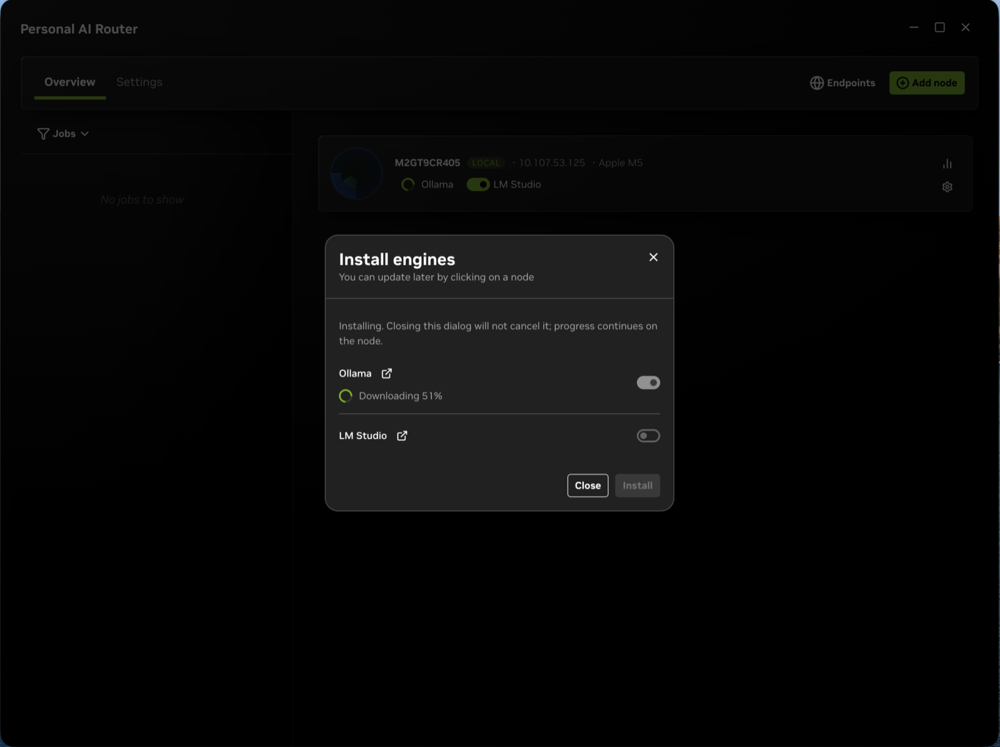
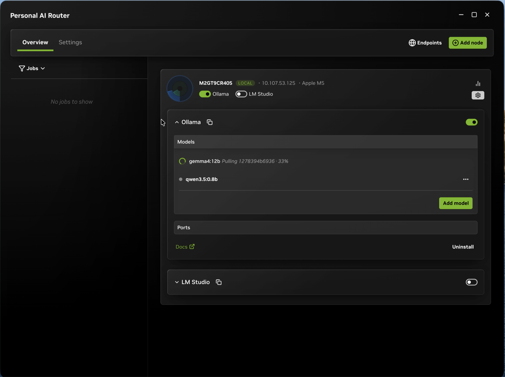
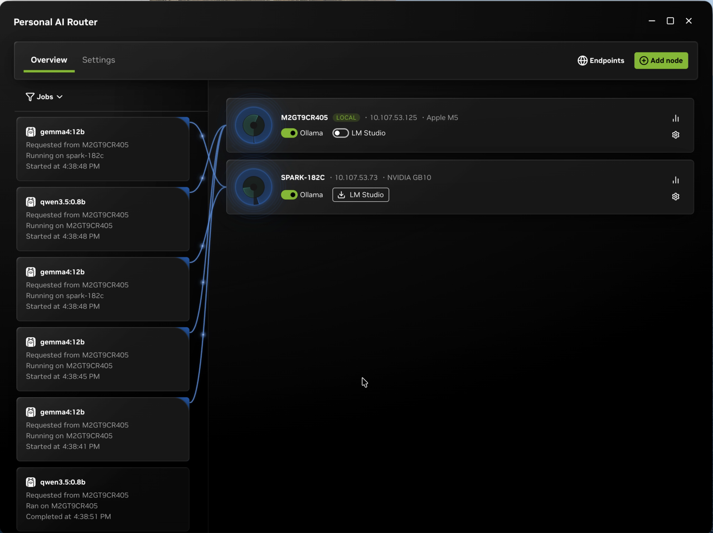
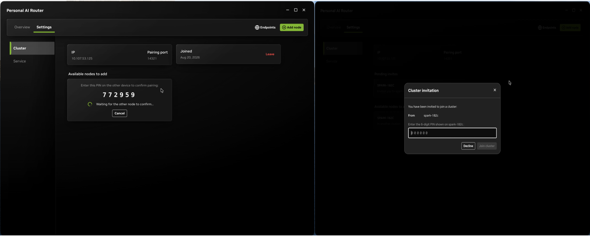

<!--
SPDX-FileCopyrightText: Copyright (c) 2026 NVIDIA CORPORATION & AFFILIATES. All rights reserved.
SPDX-License-Identifier: Apache-2.0
-->

# NVIDIA Personal AI Router (PAIR)

[](LICENSE)
[](SECURITY.md)

NVIDIA Personal AI Router (PAIR) is a local inference router for a group of
compatible computers on the same network. It discovers participating nodes,
manages supported inference engines, and presents Ollama-compatible and
OpenAI-compatible proxy endpoints to applications and agents. Independent
requests can be routed to eligible nodes according to engine availability,
model availability, and current workload.

PAIR is useful for concurrent local workloads such as multi-agent applications.
Prompts and responses are intended to remain on the local network when every
configured client, model source, engine, and node is local.

> PAIR routes each independent request to one node. It does **not** pool GPU
> memory, combine GPUs into a larger logical GPU, shard one model across
> machines, or split an in-flight inference request between nodes.


*Two paired machines: requests arrive on one, run on whichever node suits each
one, and both report live GPU and memory use throughout.
[Watch the full clip](assets/pair-demo.mp4).*

## What is supported

| | |
| --- | --- |
| **Operating systems** | Windows 11; Linux; macOS |
| **Architectures** | x64 and arm64 on all three. Windows on ARM is experimental. |
| **Installers** | Windows `.exe`; Linux `.deb`; macOS `.dmg`. On other Linux distributions, [build from source](docs/building.mdx). |
| **Mixing nodes** | Windows, Linux, and macOS nodes can all be paired with each other |
| **Inference engines** | Ollama and LM Studio |

**PAIR running on a machine does not mean an engine will.** PAIR itself runs on
any supported Windows, Linux, or macOS machine. Each engine sets its own requirements
for the operating system, GPU, and drivers, and each model needs enough memory to
load. Whether a particular engine and model work on a particular machine is
between that engine and that machine, so check the engine's own documentation
before assuming a node can serve a model. A node only becomes a candidate for a
request once it is actually running a compatible engine, and PAIR prefers the
nodes it already knows hold the model.

## Quick start

Download a released build and use the desktop application. That is the path we
recommend and the one the rest of this guide assumes. Building from source and
the terminal interface both exist for good reasons — changing PAIR, and machines
with no desktop — but neither is the ordinary way in. Those are covered in
[Building and running PAIR from source](docs/building.mdx) and
[Terminal interface](docs/terminal-interface.mdx).

### Download a release

A released installer is signed, sets up the background services and the desktop
application together, and adds the firewall rules PAIR needs on Windows. It also
tells you when a newer release exists and installs it on your say-so from
**Settings → Service**. A build you make yourself is unsigned and checks no
update feed, so you would upgrade it by pulling and rebuilding.

Download PAIR from the
[GitHub releases page](https://github.com/NVIDIA/Personal-AI-Router/releases).
Release downloads include:

- a Windows installer;
- a Debian package for Linux; and
- a macOS disk image.

**On Windows and macOS,** double-click the download and follow the installer's
usual prompts — on macOS that means dragging NVIDIA Personal AI Router to your
**Applications** folder.

**On Linux,** install the package from the directory you downloaded it into:

```bash
sudo apt install ./NVPAIR-Setup-*.deb
```

If you have kept more than one PAIR package in that directory, install the one
you want by its full filename instead.

### Run it

- **Open PAIR** the way you would any application — the Start menu on Windows,
  Launchpad or the Applications folder on macOS, your applications list on Linux.
  On a machine with no desktop environment, drive it from the
  [terminal interface](docs/terminal-interface.mdx) instead, which starts the same
  background services and gives you a full-screen view in the terminal.

- **Let it finish starting.** **Overview** shows this machine once the services
  are up. If it stays on **Loading...**, open **Settings → Service** and read the
  status there.

- **Get an engine running.** On the node's card, open **Engine settings** and
  select **Install** next to Ollama or LM Studio. PAIR downloads and sets the
  engine up for you, so nothing needs to be in place beforehand. If PAIR already
  found an engine you installed yourself, start that one instead.

  

- **Add a model.** Select **Add model** on the same card and download one.
  `qwen4:12b` is used for this example; it can be replaced with a model of your
  choice.

  

- **Send a request.** Two equally good options:

  - **Let PAIR generate the traffic.** Select **Test** on
    **Settings → Service** and PAIR sends a minute of inference through the same
    path, so you can watch the jobs appear without writing anything.

    

  - **Send one yourself.** Use the `curl` call below. The job then appears under
    **Jobs**, naming the node that served it.

With Ollama on its default port, this runs as written:

```bash
curl http://127.0.0.1:11434/v1/chat/completions \
  -H "Content-Type: application/json" \
  -d '{"model":"qwen4:12b","messages":[{"role":"user","content":"In one sentence, what does a router do?"}]}'
```

The reply is ordinary OpenAI-shaped JSON, abbreviated here:

```json
{
  "object": "chat.completion",
  "model": "qwen4:12b",
  "choices": [
    {
      "message": {
        "role": "assistant",
        "content": "A router decides where each incoming message should go and forwards it there."
      },
      "finish_reason": "stop"
    }
  ]
}
```

If you changed a port, or you are using LM Studio rather than Ollama, copy the
URL from **Endpoints → API endpoints** instead of assuming the one above.

That is a single machine working. To route across machines, pair a second one
from **Settings → Cluster** and repeat the engine and model steps there. The
inviting machine shows a six-digit PIN, and you enter that PIN on the machine you
invited.



The [Getting Started Guide](docs/getting-started.mdx) covers the same ground in
detail, plus pairing, ports, and connecting your own applications.

## Uninstalling

Removing PAIR and removing your data are separate steps, and the default is to
keep your data.

**Windows.** Uninstall from Apps & features, or the Start menu entry. The
uninstaller stops PAIR, removes its firewall rules, and asks whether to delete
your data. Decline and it stays; accept and it is removed.

**Linux.** `sudo apt remove nvpair` uninstalls the application and keeps your
data. Use `sudo apt purge nvpair` to remove the data as well. Run
`dpkg -l | grep -i pair` first if you need to confirm the installed package name.

**macOS.** Run the uninstaller that ships inside the app bundle. It stops PAIR,
removes its firewall rules, unregisters its privileged helper, and then removes
the application:

```bash
sudo "/Applications/PAIR.app/Contents/Resources/installer-tools/uninstall-macos.sh"
```

Add `--purge` to remove your data as well. Dragging PAIR to the Trash instead
leaves the privileged helper registered, so use the uninstaller.

Your data means settings, logs, cluster identity and certificates, and any engine
PAIR installed for you. **Model weights are not touched** — they live in the
engine's own storage, such as `~/.ollama`, so removing PAIR does not delete the
models you downloaded. Delete those through the engine, or by removing its
directory.

**To clear your data without uninstalling,** use **Settings → Service → Reset app
data**. It removes the same set — settings, logs, cluster identity and
certificates, and PAIR-installed engines — then restarts the application as if it
were newly installed. Model libraries are left alone here too. This is the quickest
way to start over after a broken cluster or a bad engine install.

If this machine belongs to a cluster, deal with membership too — otherwise the
other nodes keep listing it as a member. You have two options:

- **Leave from this machine** before uninstalling: **Settings → Cluster →
  Leave**, or press `L` on the terminal interface's **Cluster** tab.
- **Remove it from another node**, which any member can do from
  **Settings → Cluster** by removing that node from the list.

The second option works after the fact as well, so forgetting to leave first is
recoverable.

## Documentation

If you are new to PAIR, reading in this order will get you productive fastest.
Each entry assumes the ones before it.

1. **[Overview](docs/overview.mdx)** — what PAIR does and how its pieces fit
   together. Start here so the vocabulary in every other document makes sense.
2. **[Getting started](docs/getting-started.mdx)** — install it, pair two
   machines, prepare a model, and send a first request. This is the only document
   most users need.
3. **[Managing engines](docs/engine-lifecycle.mdx)** — install, start, stop,
   update, and uninstall engines; what PAIR restores after you quit or relaunch.
4. **[Terminal interface](docs/terminal-interface.mdx)** — the same tasks from a
   terminal, for a machine with no desktop environment. Skip it if every machine
   you run has a desktop.
5. **[Troubleshooting](docs/troubleshooting.mdx)** — worth skimming once before
   you need it, so you know where the diagnostics live. Alongside it,
   **[Known issues](docs/known-issues.mdx)** lists the significant limitations we
   are already aware of, and
   **[Collecting and sanitizing logs](docs/log-collection.mdx)** covers preparing
   a log you can share.
6. **[Architecture](docs/architecture.mdx)** — the process model, how a request is
   routed, and where the trust boundaries are. Read this before changing
   anything, or if you want to know why PAIR behaves the way it does.
7. **[Building and running](docs/building.mdx)** — prerequisites, building from
   source, running the services without the desktop application, and writing
   your own client against the JSON-RPC API.
8. **[Developer guide](docs/developing.mdx)** — read this before contributing:
   where the code lives, how a change travels through the layers, and the
   conventions the project enforces.

Component references, for when you already know what you are looking for:

- [Services](services/readme.md) — the background services, and from there each
  component's own reference
- [Desktop application](desktop/README.md) — working in the application, and from
  there its architecture, contracts, and CLI documentation

## Releases

See the [releases page](https://github.com/NVIDIA/Personal-AI-Router/releases)
for what changed in each release.

## Where PAIR is going

We have plenty of ideas about where to take PAIR, and no fixed commitments about
which of them land or when. If you have a thought about the product's direction,
something that would make it more useful to you, a workflow it does not support
yet, or a use we have not considered — we would like to hear it. Open an issue
and start the conversation.

**Routing is the clearest example.** Today PAIR ships a single scheduling policy
that combines queued work with a coarse, smoothed GPU-utilization signal. It does
not consider GPU model, available memory, model warmness, or how expensive a
request looks, which still makes it a better fit for similar machines than a
highly mixed cluster. Making that smarter, and likely letting you choose a
policy, is something we want to do — and hearing which of those signals matters
on your hardware is exactly the kind of input that would shape it.

Feedback from people running PAIR on their own hardware is more useful to us than
any plan written in advance.

## Contributing and governance

- [Contributing](CONTRIBUTING.md)
- [Code of Conduct](CODE_OF_CONDUCT.md)
- [Governance](GOVERNANCE.md)

## Support

See [SUPPORT.md](SUPPORT.md) for public support channels and scope.

## Security

PAIR includes local HTTP endpoints, LAN discovery, a PIN-based trust bootstrap,
and cluster networking. Read [SECURITY.md](SECURITY.md) before deploying it on
an untrusted or shared network. Do not report vulnerabilities in a public issue.

## License

This project is licensed under the [Apache License 2.0](LICENSE). See
[Third-Party Software Notices](THIRD_PARTY_NOTICES.md) for bundled dependencies.
Inference engines, models, and other software used with PAIR may have separate terms.
