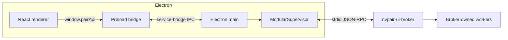

<!--
SPDX-FileCopyrightText: Copyright (c) 2026 NVIDIA CORPORATION & AFFILIATES. All rights reserved.
SPDX-License-Identifier: Apache-2.0
-->

# Personal AI Router Architecture

Personal AI Router is an Electron desktop application backed by the modular Go
services in the sibling `services/` directory of this repository. The renderer
never connects directly to backend processes. Electron main owns process
lifecycle and exposes a typed preload bridge to the UI.

## Process model

`nvpair-ui-broker` is the only backend binary Electron spawns directly. The
broker supervises every runtime worker and relays their JSON-RPC methods and
notifications. In development binaries live in `cli-bin/`; packaged builds load
them from `process.resourcesPath/cli-bin`.

The canonical runtime inventory is
`src/shared/constants/modular-binaries.ts`:

| Binary                    | Owner            | Purpose                                     |
| ------------------------- | ---------------- | ------------------------------------------- |
| `nvpair-ui-broker`        | Electron         | Worker supervision and control-plane relay  |
| `ollama-proxy`            | Broker           | Ollama-compatible proxy and cluster routing |
| `lmstudio-proxy`          | Broker, optional | LM Studio OpenAI-compatible proxy           |
| `nvpair-node-scanner`     | Broker           | LAN discovery and announcement              |
| `nvpair-node-info`        | Broker           | Node metadata and telemetry endpoint        |
| `nvpair-workload-manager` | Broker, optional | Workload replication                        |
| `nvpair-cluster-manager`  | Broker, optional | Cluster identity, pairing, and membership   |
| `nvpair-node-settings`    | Broker           | Persisted node identity and settings        |
| `nvpair-manual-nodes`     | Broker, optional | User-managed discovery entries              |
| `nvpair-engine-manager`   | Broker, optional | Engine lifecycle and model operations       |
| `nvpair-errors`           | Broker, optional | Error registry and peer synchronization     |
| `nvpair-job-scheduler`    | Broker, optional | Node-wide routing priority                  |

`nvpair-tui` is bundled as a standalone terminal client; it is not supervised by
Electron or the broker. It spawns and owns its own `nvpair-ui-broker`, so it runs
over SSH with no display. It is what the `nvpair` command on PATH resolves to on
every platform — see [Terminal use](#terminal-use).

## Communication boundaries

### Renderer to service

The renderer uses `window.pairApi`. Its logical invoke and push contracts are
declared in `src/shared/types/ws-channels.ts`. Preload forwards them through the
`service-bridge:invoke` and `service-bridge:push` IPC envelope.

Electron main handles logical requests in
`src/electron/service-bridge/empty-handlers.ts`. Backend notifications update
`ModularBridgeState`, which emits typed push events to preload.

See [Frontend API Reference](frontend-api.md) for the channel surface.

### Renderer to Electron

`window.windowApi` is reserved for Electron-native operations:

- window and tray management;
- clipboard access;
- service lifecycle and log access;
- updater commands and status;
- first-run settings.

These channels are declared in `src/shared/types/ipc-channels.ts` and handled
with `safeHandle()`.

### Terminal use

Personal AI Router has no Electron-backed console client. The terminal interface
is the bundled Go `nvpair-tui`, which owns its own broker and worker tree and is
independent of the desktop app.

On packaged builds the app generates an `nvpair` launcher on PATH that execs
`resources/cli-bin/nvpair-tui` (`src/electron/nvpair-command.ts`): a `.cmd`
under `<userData>\bin` on Windows, with that directory appended to the per-user
PATH, and a shell script in `~/.local/bin` or `/usr/local/bin` otherwise. The
Debian package installs the same wrapper at `/usr/bin/nvpair`. The desktop entry
launches the GUI directly from `/opt` and does not go through the wrapper.

Because the TUI starts its own broker, do not run it alongside the desktop app —
the two process trees compete for the same engines and proxy ports.

### Electron to backend

`JsonRpcSubprocess` provides newline-delimited JSON-RPC over stdio. The
supervisor passes worker paths and the configured log level to the broker,
subscribes to broker relays after `app:ready`, and converts backend responses
into stable UI contracts.

Electron reports the service connected after broker `app:ready`. The
broker-owned Ollama and LM Studio proxies remain asynchronous capabilities; a
late or failed proxy does not misreport the broker startup as failed. If
`app:ready` does not arrive within the startup deadline, Overview opens Settings

> Service, surfaces the failure, and leaves restart and log actions available
> instead of loading indefinitely. A late `app:ready` notification restores
> connected state.

A service that is not running at all — stopped from Settings, or exited on its
own — is reported only by the Electron connector, since a dead broker sends
nothing over the bridge. Overview and the tray therefore treat
`connectorStatus === 'disconnected'` as its own state and render a stopped
notice with a Start control, rather than the spinner that would otherwise wait
on a service nobody is starting. When the connector reaches `connected` again,
the renderer re-reads every domain snapshot, because the restarted broker builds
a fresh state projection.

The only direct backend HTTP polling in Electron is `/v1/node-info`: Electron
polls healthy local and discovered nodes every two seconds because rich
telemetry is not part of the broker JSON-RPC surface. Consecutive failures back
off to 4, 8, 16, then 30 seconds; the first success or a changed endpoint
restores the normal cadence.

## State flow

Personal AI Router uses commands down and events up:

1. A renderer action invokes a typed service command.
2. Electron dispatches it through the broker.
3. Backend notifications update `ModularBridgeState`.
4. Push events update renderer stores.

Renderer stores fetch domain snapshots at startup and then subscribe to push
events. Engine lifecycle and model commands do not return replacement state.
The centralized pending-actions store is the only optimistic renderer state for
engine operations.

Important push domains include:

- `nodes:upsert` / `nodes:remove`;
- `engines:state-changed`;
- `engines:progress-changed` / `engines:progress-cleared`;
- `metrics:update`;
- `workloads:upsert` / `workloads:remove`;
- `errors:update`;
- `discovery:nodes-changed`;
- `connection:cluster-identity`;
- `cluster:invite-received`;
- `cluster:pending-invites-changed`;
- `state:request-refresh`.

## Discovery, pairing, and trust

`nvpair-node-scanner` owns LAN discovery. Personal AI Router consumes the broker's
`AvailableNode` snapshots and does not construct or interpret the backend's
discovery service names.

Personal AI Router keys every node by the backend's stable per-host UUID (`AvailableNode.id` /
`hostUuid`), not the hostname. That same UUID keys workload attribution
(`originatedFrom`/`scheduledOn`), errors (`nodeId`), proxy routing (`Node.ID`),
`/v1/node-info`, and cluster membership (`ClusterNode.nodeUuid`), and it is the
value of `selfId` (the cluster-manager `nodeUuid`, resolved as soon as the broker
is ready). The hostname is retained only as the display `name`. This lets one
merge collapse the broker- and proxy-reported views of a node into a single
entry and makes cross-domain correlation exact. `AvailableNode` also carries the
`trusted` and `clustered` flags; Personal AI Router renders an already-`clustered` node as
non-invitable.

Cluster admission, identity, trusted certificates, membership, and every
node-to-node channel are owned by `nvpair-cluster-manager` and the other
backend workers. Personal AI Router implements no cluster cryptography, no certificate or key
handling, and no transport security. It only relays `cluster:*` / `nodes:*`
requests to the broker and renders the resulting notifications (invite status,
membership). An outbound invite can be canceled through `cluster:cancel-invite`,
which invalidates the PIN backend-side and notifies the joiner; a `rejected`
invite surfaces its reason (e.g. `already-clustered`). Pairing uses a low-entropy
convenience PIN; UI copy must not present it as a strong authenticator. See the
repository [`SECURITY.md`](../../SECURITY.md).

## Engines and routing

Engine lifecycle and model operations flow through the broker's `engine:*`
relay to `nvpair-engine-manager`. The renderer identifies engines with the
closed `EngineType` union and narrows external strings with `isEngineType()`.

The Ollama and LM Studio proxies are cluster-aware. For model-bearing inference,
each proxy first keeps only nodes whose per-engine discovery inventory advertises
the requested model. Empty and non-matching inventories are excluded; an empty
owner set returns a local `502`. Routing precedence within the eligible set is:

1. a user-selected manual node;
2. the priority list emitted by `nvpair-job-scheduler`;
3. the proxy's deterministic default ordering.

The scheduler combines total pending (queued and running) workload across both
engines with a smoothed 0–3 pressure derived from the busiest GPU. Missing,
invalid, or older-than-10-second telemetry has neutral pressure. It emits the
order, pending count, and pressure, reranking on meaningful workload, discovery,
or pressure changes with a periodic reconciliation fallback. Each proxy chooses
with `pending + gpuPressure + localReservations`, so concurrent bursts spread
across eligible owners before workload feedback arrives. An upstream `404`
remains retryable among advertised owners because an inventory snapshot can
become stale. Electron's richer renderer metrics are display-only; Electron does
not select or pin proxy routes.

An NVPAIR-launched engine binds to loopback and is never directly LAN-reachable.
Peers reach it only through the node's proxy over a cluster-mTLS ingress, so
discovery advertises the promoted proxy port for `ol`/`lm` rather than the
engine's private port. This transport security is backend-owned; Electron only
reflects the advertised proxy port and reads a remote engine's real port from
`engine:remote-get-installed` facts.

The model hub is Electron-main functionality in `src/electron/model-hub/`:

- Ollama models come from a locked, committed list
  (`src/electron/model-hub/ollama-models.json`) bundled into the main process —
  there is no runtime Ollama scraping. Devs regenerate the list with
  `npm run scrape:ollama-models` (`scripts/scrape-ollama-models.ts`) and commit
  it when Ollama's catalog changes;
- LM Studio models come from the curated `lmstudio-community` catalog, still
  fetched live from Hugging Face and cached for six hours. The cache is warmed
  when the Overview renderer reports ready, not when the service connects, so a
  slow or hanging catalog fetch cannot compete with the window's first paint;
- model pulls still run through `nvpair-engine-manager`.

## Inference Demo

The Inference Demo sends a fixed sixty-second burst of synthetic inference
traffic through the local proxies so job activity is visible on Overview. It is
the one place Electron launches a non-broker executable.

- The schedule is built and owned by Electron main
  (`src/electron/inference-demo.ts` and
  `src/electron/inference-demo-schedule.ts`).
- Each scheduled request spawns the bundled `inference-dispatcher` client, a
  standalone Go HTTP client that knows nothing about the broker, JSON-RPC, or
  discovery. Its source is `scripts/inference-dispatcher` at the monorepo root
  and it ships in `resources/tools`, outside the services `cli-bin` inventory.
  See [Inference dispatcher](../../docs/inference-dispatcher.mdx).
- Requests are addressed to a proxy port reported by the broker, never to an
  engine's own port, so the backend places them exactly as it would place any
  third-party client's traffic. PAIR makes no routing decision.
- Progress is broadcast on the `demo:state` Electron push channel
  (`IpcPushChannelMap`), not the service push bus. State is node-local and is
  never synchronized across the cluster.
- Prompts and responses are never surfaced or logged; child processes run with
  `stdio: 'ignore'` and with the `INFERENCE_DISPATCHER_*` environment namespace
  stripped so an inherited variable cannot redirect output to disk.

## Local HTTP endpoints

Backend-owned ports are reported at runtime where available. Constants that
cannot yet be reported are centralized in
`src/shared/constants/modular-runtime.ts`.

- Ollama-compatible clients use the proxy port reported by the broker.
- Cluster pairing currently uses port `14321`.
- Node telemetry is read from `/v1/node-info` at each discovered node's
  advertised port.

Inference prompts, messages, chunks, and response bodies must not be logged.

## Build

`npm run build:modular-binaries` compiles the sibling `services/` tree for the
selected platform and architecture. The `cli-bin/manifest.json` it writes records
the source path and fingerprint, the product and component versions, the target,
and per-file hashes. The build rejects unexpected files in `cli-bin/`.

Electron Builder produces:

- Windows NSIS installers;
- Linux `.deb` packages;
- macOS `.dmg` installers and `.zip` update payloads.

`npm run build:tools` compiles the `inference-dispatcher` client into `tools/`,
which is packaged as a separate `extraResources` directory with its own manifest
and packaging assertion.

The macOS build also compiles the `SMAppService` privileged helper used to
configure Application Firewall rules. Firewall membership comes from
`needsFirewallAccess` in `MODULAR_RUNTIME_BINARIES`, and
`npm run service-contracts:check` verifies the Swift helper matches it. See
[macOS Privileged Helper](macos-privileged-helper.md).

## Data locations

Personal AI Router and the Go services share one current per-user root:

- `Nvidia Corporation/Personal AI Router`.

On first launch after the rename, Electron data under
`NVIDIA Corporation/PAIR` is merged into the shared directory without
overwriting backend files already present there.

Uninstalling keeps user data by default or requires an explicit removal action.
The Electron updater cache is separate from the shared root.

### Resetting app data without uninstalling

PAIR exposes a canonical, **append-only** wipe inventory in the repo-root scripts
`scripts/wipe-app-data.sh` (Linux and macOS) and `scripts/wipe-app-data.ps1`
(Windows).
They list every PAIR-owned path (current and historical layouts) and are never
shrunk — when storage moves, both old and new locations stay listed so upgrades
from any prior version remain recoverable. No Node runtime is required.

| Path                                                     | Behavior                                                                                               |
| -------------------------------------------------------- | ------------------------------------------------------------------------------------------------------ |
| Settings → Service → **Reset app data**                  | Confirms stop → wipe; packaged also relaunches into first-run; unpackaged quits and prompts to restart |
| `scripts/wipe-app-data.sh` / `scripts/wipe-app-data.cmd` | Clean-only manual entrypoints; require confirmation; do not relaunch                                   |

Packaged builds ship the same scripts under `resources/scripts/` so the app invokes
the identical inventory. Platform uninstall scripts should stay aligned with these
files (see comments in `scripts/wipe-app-data.*` and
`desktop/scripts/build/installer.nsh`).

The in-app path never deletes while Electron is alive, otherwise Chromium flushes
session and cache files back into the directories just removed. Instead Electron
stops the service tree, spawns the script detached with `--wait-pid=<electron pid>`,
and exits. The script waits for the process to disappear, then wipes. Packaged
builds also pass `--relaunch=<app executable>` so the script starts the app after
deletes finish. Unpackaged (`electron-vite dev`) builds omit relaunch and the UI
tells the developer to run `npm start` again — quitting Electron tears down the Vite
renderer server, so auto-relaunch would come up with nothing to load.

Third-party model libraries (`~/.ollama`, `~/.lmstudio`) and the application install
tree are never removed.

## Sources of truth

- UI invoke/push contract: `src/shared/types/ws-channels.ts`
- Electron IPC contract: `src/shared/types/ipc-channels.ts`
- Runtime binary inventory: `src/shared/constants/modular-binaries.ts`
- Runtime defaults: `src/shared/constants/modular-runtime.ts`
- Backend API extraction: `docs/services-api.md`
- Services backend integration: `docs/services-backend.md`
- Current capability status: `docs/services-parity.md`
