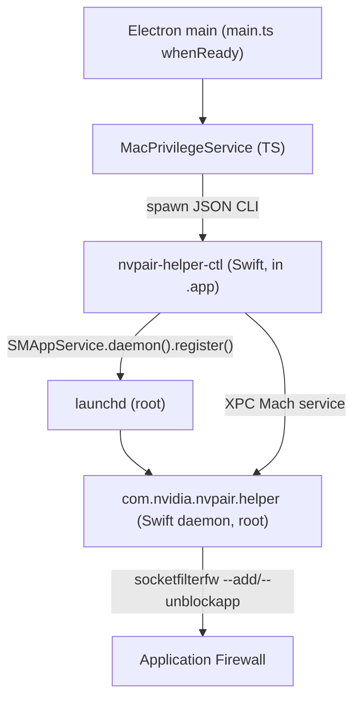

<!--
SPDX-FileCopyrightText: Copyright (c) 2026 NVIDIA CORPORATION & AFFILIATES. All rights reserved.
SPDX-License-Identifier: Apache-2.0
-->

# macOS Privileged Helper (SMAppService)

Personal AI Router ships as a drag-to-install `.dmg` on macOS. A `.dmg` has **no installer
step**, so adding the bundled networked binaries to the macOS Application
Firewall runs on **first launch** through an Apple
[`SMAppService`](https://developer.apple.com/documentation/servicemanagement/smappservice)
LaunchDaemon bundled inside the `.app`.

`minimumSystemVersion` is `13.0` because `SMAppService` requires macOS 13+.

## Components

| Component             | Path in `.app`                                                  | Language | Role                                                                                                                                         |
| --------------------- | --------------------------------------------------------------- | -------- | -------------------------------------------------------------------------------------------------------------------------------------------- |
| Daemon                | `Contents/MacOS/com.nvidia.nvpair.helper`                       | Swift    | Runs as **root** under launchd; vends a fixed XPC command surface; applies `socketfilterfw` rules.                                           |
| Control tool          | `Contents/MacOS/nvpair-helper-ctl`                              | Swift    | User-context CLI Electron spawns; registers/unregisters the daemon via `SMAppService`; relays XPC requests; prints one JSON object per call. |
| LaunchDaemon plist    | `Contents/Library/LaunchDaemons/com.nvidia.nvpair.helper.plist` | plist    | launchd config: `Label`, `BundleProgram`, `MachServices`, `AssociatedBundleIdentifiers`.                                                     |
| Shared protocol       | `native/Shared/HelperProtocol.swift`                            | Swift    | Compiled into **both** binaries so the XPC interface + security constants never drift.                                                       |
| `MacPrivilegeService` | `src/electron/services/mac-privilege-service.ts`                | TS       | UI-free wrapper; the only path Electron uses to drive the helper.                                                                            |
| Lifecycle wiring      | `src/electron/main.ts` (`runMacPrivilegedSetup`)                | TS       | First-run dialog + `ensureConfigured()` at `app.whenReady`; one-time gate in `ui-config.ts`.                                                 |

Both Mach-O binaries sit in `Contents/MacOS/` so the control tool's `Bundle.main`
resolves to the host `.app` (required by `SMAppService.daemon(plistName:)`).

## Runtime flow

`runMacPrivilegedSetup()` runs once per launch:

1. **First run only** — show an info dialog explaining macOS will ask to approve a
   background helper.
2. Call `macPrivilege.ensureConfigured(firstTime)`, which (no UI):
    - reads `nvpair-helper-ctl status`;
    - if the daemon version != app version (in-place Squirrel.Mac update),
      `uninstall` + `install` to refresh it, and force a firewall reconfigure;
    - if not registered, `install` (which calls `SMAppService.daemon().register()`);
    - when `enabled`, run `configure-firewall` (no `--app-path`: the daemon
      derives the target bundle from the verified caller — see Security).
3. On `requiresApproval`, the control tool calls
   `SMAppService.openSystemSettingsLoginItems()`; main surfaces guidance to
   enable the background item under **System Settings → General → Login Items &
   Extensions**, then relaunch.
4. On success (`enabled` + firewall configured), set the one-time
   `macHelperSetupComplete` flag in `ui-config.ts`.

The firewall is reconfigured on first run, after a version refresh, and after a
fresh registration (so a release that adds a networked binary still gets its
rule); otherwise the idempotent `socketfilterfw` work is skipped to keep launches
cheap.

## XPC command surface

`PAIRHelperProtocol` (`native/Shared/HelperProtocol.swift`) is the entire surface
— there is **no arbitrary shell**:

| Method                       | Action                                                                                                                                 |
| ---------------------------- | -------------------------------------------------------------------------------------------------------------------------------------- |
| `getVersion`                 | Returns the daemon build version (stamped to equal the app version).                                                                   |
| `configureFirewall(appPath)` | `--add` + `--unblockapp` each bundled networked binary. `appPath` is ignored — the daemon derives the bundle from the verified caller. |
| `removeFirewall(appPath)`    | `--remove` each bundled networked binary. `appPath` ignored.                                                                           |

### Networked binaries (firewall set)

The daemon adds rules only for cli-bin binaries that open a listening socket.
Stdio-only or client-only binaries (`nvpair-node-settings`,
`nvpair-manual-nodes`, `nvpair-job-scheduler`, `nvpair-ui-broker`) get no rule.
The set in `native/PrivilegedHelper/main.swift` must stay in sync with the
`needsFirewallAccess` metadata in `MODULAR_RUNTIME_BINARIES`
(`src/shared/constants/modular-binaries.ts`) and the manual uninstaller.
`npm run service-contracts:check` fails when the Swift list differs from that canonical set:

`ollama-proxy`, `lmstudio-proxy`, `nvpair-node-info`, `nvpair-node-scanner`,
`nvpair-workload-manager`, `nvpair-errors`, `nvpair-cluster-manager`,
`nvpair-engine-manager`.

> These eight mirror the per-program/per-port `netsh` rules in
> `scripts/build/installer.nsh` on Windows. macOS's Application Firewall is
> per-application and inbound-only, so one `--add`/`--unblockapp` per binary
> collapses Windows's per-port rules.

## Security

Code-signing requirements are pinned (constants in `HelperProtocol.swift`, Team
ID `6KR3T733EC`). Each shares a common `developerIdAnchor`: `anchor apple
generic` **plus** the Developer ID intermediate marker
(`certificate 1[field.1.2.840.113635.100.6.2.6]`), the Developer ID Application
leaf marker (`certificate leaf[field.1.2.840.113635.100.6.1.13]`), and the Team
ID OU. Pinning the Developer ID markers (not just `anchor apple generic` + OU)
prevents any Apple-anchored cert under the same Team ID from satisfying the
requirement.

- **`ctlCodeSigningRequirement`** — `identifier "nvpair-helper-ctl" and
<developerIdAnchor>`. The daemon pins this on every **inbound** XPC connection
  (`setCodeSigningRequirement`), so only the control tool — pinned by signing
  identifier, not merely Team ID — can drive privileged ops.
- **`daemonCodeSigningRequirement`** — `identifier "com.nvidia.nvpair.helper" and
<developerIdAnchor>`. The control tool pins this on its **outbound** connection
  so a hijacked Mach service name cannot answer.
- **`appCodeSigningRequirement`** — `identifier
"com.nvidia.nvpair" and <developerIdAnchor>`, used to
  re-verify the target bundle.

**Confused-deputy fix.** The daemon no longer trusts an `--app-path` argument.
It derives the target bundle from the **verified identity of the connecting
process**: it resolves the caller's `SecCode` from its PID, checks it against
`ctlCodeSigningRequirement`, and reads the control tool's own path — the `.app`
is its grandparent-of-`Contents/MacOS`. A caller can therefore only ever
configure **its own** bundle, never point the daemon at an arbitrary
NVIDIA-signed `.app`.

**TOCTOU / symlink hardening.** Before mutating firewall state the daemon
re-validates the derived bundle: reject path traversal, reject a symlinked
`.app` / `cli-bin` (final component opened with `O_NOFOLLOW`), reject
group/other-writable ancestor directories, and verify the bundle signature
against `appCodeSigningRequirement`. Immediately before each `socketfilterfw`
invocation it re-opens the individual binary with `O_NOFOLLOW` and re-verifies
that binary's own NVIDIA signature, and it now **fails** (rather than ignoring)
any non-zero `socketfilterfw` exit.

## Build & signing

- `scripts/build/macos/build-helper.ts` compiles both binaries with `swiftc` via
  `xcrun` for `arm64` + `x86_64`, then `lipo`s them into universal Mach-Os under
  `native/build/`. It also generates `HelperVersion.swift` from `package.json`.
  Wired as a `prebuild` for `build:electron:mac:{x64,arm64}` in `package.json`.
- `electron-builder.config.ts` bundles the binaries + plist via `mac.extraFiles`.
- Official (signed) builds sign each helper binary individually with hardened
  runtime **before** the app, alongside the modular binaries. The public build
  is unsigned.
- macOS packaging requires `swiftc`; build environments should verify it with
  `xcrun --find swiftc`.

## Uninstall

`scripts/build/macos/uninstall.sh` (shipped at
`Contents/Resources/installer-tools/uninstall-macos.sh`) unregisters the daemon
via `nvpair-helper-ctl uninstall` **before** removing the app, while the control
tool still exists. `SMAppService` state is tied to the real user's session, so
when invoked via `sudo` the tool is run as the invoking user. A
missing/unregistered daemon is ignored (best-effort).

## Open risks

- SMAppService daemon approval UX varies across macOS 13.x (inline prompt vs
  System Settings → Login Items).
- Release signing must preserve each helper binary's hardened runtime and
  signature; verify each binary after signing.
