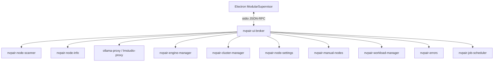

<!--
SPDX-FileCopyrightText: Copyright (c) 2026 NVIDIA CORPORATION & AFFILIATES. All rights reserved.
SPDX-License-Identifier: Apache-2.0
-->

# Services Backend Integration

The `services/` tree is Personal AI Router's backend and the source of truth for
service behavior. It lives as a sibling directory in this monorepo, and Personal
AI Router builds its bundled binaries directly from that source.

Personal AI Router does not reimplement backend behavior in TypeScript. Electron main owns
process startup, translates JSON-RPC into the stable frontend contract, and
projects backend notifications into renderer state.

## Runtime ownership

`nvpair-ui-broker` is the only backend process Electron starts directly. The
broker supervises every worker and relays its control plane.

| Binary                    | Runtime role                                              |
| ------------------------- | --------------------------------------------------------- |
| `nvpair-ui-broker`        | Worker supervision and relay                              |
| `ollama-proxy`            | Ollama-compatible routing proxy with cluster-mTLS ingress |
| `lmstudio-proxy`          | LM Studio routing proxy with cluster-mTLS ingress         |
| `nvpair-node-scanner`     | Discovery and node announcement                           |
| `nvpair-node-info`        | Node metadata and telemetry                               |
| `nvpair-manual-nodes`     | User-managed node entries                                 |
| `nvpair-workload-manager` | Workload replication                                      |
| `nvpair-errors`           | Error registry and peer sync                              |
| `nvpair-node-settings`    | Persisted node settings                                   |
| `nvpair-engine-manager`   | Engine lifecycle and model operations                     |
| `nvpair-cluster-manager`  | Pairing, trust, and membership                            |
| `nvpair-job-scheduler`    | Node-wide routing priority                                |
| `nvpair-tui`              | Bundled standalone terminal client                        |

The runtime inventory and ownership flags live in
`src/shared/constants/modular-binaries.ts`. Product and component versions live
only in `services/versions.json` and are rendered into `docs/services-api.md` by
`service-contracts:write` — do not restate version numbers in this document.



Optional workers are non-fatal at runtime, but a normal build produces every
binary from the `services/` source.

## Electron integration

The main integration points are:

| Responsibility                                                     | File                                                 |
| ------------------------------------------------------------------ | ---------------------------------------------------- |
| Process startup, broker flags, subscriptions, notification routing | `src/electron/service-bridge/modular-supervisor.ts`  |
| JSON-RPC stdio framing                                             | `src/electron/service-bridge/json-rpc-subprocess.ts` |
| Logical invoke handlers                                            | `src/electron/service-bridge/empty-handlers.ts`      |
| Node, engine, workload, and error projection                       | `src/electron/service-bridge/modular-state.ts`       |
| Node telemetry polling                                             | `src/electron/service-bridge/node-info-poller.ts`    |
| Runtime binary inventory                                           | `src/shared/constants/modular-binaries.ts`           |
| Backend-coupled defaults                                           | `src/shared/constants/modular-runtime.ts`            |
| Frontend channel contract                                          | `src/shared/types/ws-channels.ts`                    |

After the broker emits `app:ready`, Electron subscribes to discovery, proxy,
engine, workload, cluster, and error relays. The bridge then emits renderer push
events from backend notifications.

Connector readiness follows the broker contract: `app:ready` establishes the
service connection, while Ollama and LM Studio proxy readiness remains an
asynchronous capability signal. Personal AI Router waits up to the canonical
startup deadline in `src/shared/constants/modular-runtime.ts` for
`app:ready`; an outright failure or stalled broker startup is surfaced in
Settings > Service with retry and log access. If a stalled broker reports ready
later, the connector transitions to connected without spawning a second broker.

### Direct HTTP exception

The broker does not expose rich node telemetry over JSON-RPC. Electron therefore
polls each healthy discovered node's advertised `/v1/node-info` endpoint every
two seconds and merges CPU, memory, GPU, and VRAM data into `metrics:update`;
consecutive failures back off to a 30-second cap and reset on success.
Those renderer snapshots are display-only. Independently, the backend scanner
samples a compact maximum-GPU utilization value on the same healthy cadence,
with the same capped failure backoff, and sends it through the broker to the
scheduler.

All other service control flows through broker JSON-RPC. Engine proxy HTTP is
reserved for inference clients.

## Current domain routing

| Backend notification                                 | Personal AI Router handling                                                                                                     | Renderer push                                             |
| ---------------------------------------------------- | ------------------------------------------------------------------------------------------------------------------------------- | --------------------------------------------------------- |
| `app:ready`                                          | Complete broker startup and refresh snapshots                                                                                   | `state:request-refresh`                                   |
| `discovery:nodes-changed`                            | Replace discovery snapshot and diff nodes                                                                                       | `discovery:nodes-changed`, `nodes:upsert`, `nodes:remove` |
| `proxy:ready` / `lmstudio-proxy:ready`               | Record engine proxy port                                                                                                        | `engines:state-changed`                                   |
| proxy `node/*`                                       | Update per-engine node presence; the advertised port is the peer's promoted proxy port (not the engine's private loopback port) | node and engine pushes                                    |
| `engine:ready` / `engine:state-changed`              | Update engine facts and models                                                                                                  | `engines:state-changed`                                   |
| `engine:install-progress` / `engine:remote-progress` | Update operation progress                                                                                                       | engine progress pushes                                    |
| `errors:update`                                      | Replace the error snapshot                                                                                                      | `errors:update`                                           |
| `cluster:invite-received`                            | Parse inbound invite                                                                                                            | `cluster:invite-received`                                 |
| `cluster:invite-canceled` / `cluster:invite-expired` | Prune the canceled or timed-out inbound invite from the authoritative set                                                       | `cluster:pending-invites-changed`                         |
| `cluster:identity-changed`                           | Persist local identity                                                                                                          | `connection:cluster-identity`                             |
| `nodes:changed`                                      | Replace membership snapshot                                                                                                     | `nodes:changed`                                           |
| `workloads:upsert` / `workloads:remove`              | Update workload catalog                                                                                                         | workload pushes                                           |

`nvpair-job-scheduler` combines queued and running work across both engines with
a smoothed 0–3 pressure from the busiest GPU. Invalid, missing, or
older-than-10-second telemetry receives neutral pressure. It emits
`schedule:priority` with order, pending count, and pressure; the broker applies
each snapshot to the matching proxy through `node/set-priority`
(generation-ordered so a stale async call cannot overwrite a newer snapshot,
and re-pushed when a proxy respawns). Each proxy atomically minimizes
`pending + gpuPressure + localReservations`, so simultaneous requests account
for one another before workload feedback arrives. None of this internal
scheduling traffic is forwarded to Personal AI Router.

## Engine lifecycle behavior

`nvpair-engine-manager` owns installed/running state, persisted engine ports,
model operations, and desired engine state across app restarts.

The backend emits terminal lifecycle state and install progress. Personal AI Router maintains
one centralized pending-action layer so controls respond immediately while
waiting for authoritative state. Pending state clears on matching engine state,
progress, or error pushes.

Local engine operations include install, start, stop, uninstall, update, port
changes, and model actions. Remote cluster operations use the engine manager's
remote control surface where supported.

`engine:stop` (and its cluster `ec` equivalent) reclaims an orphan a prior run
left on the engine's own managed port, terminating it only when that PID is
running the binary NVPAIR manages. A genuinely foreign listener on a different
port is declined with an actionable error, but the user's OFF intent is still
persisted. Personal AI Router therefore treats the saved desired state as authoritative and
surfaces a stop error as guidance, not as proof the OFF choice was lost.

Stopping a managed engine sends one stop signal and then waits for the process
to exit, with no timeout — there is no grace-then-force escalation. On Unix that
signal is SIGTERM to the process group (graceful, never escalated to SIGKILL);
on Windows it is `taskkill /T /F`, because the windowless engines NVPAIR spawns
cannot receive a graceful (non-`/F`) close. A forced PID kill survives only in
the orphan-reclaim path, for a process whose `exec.Cmd` handle was lost.

Personal AI Router calls `engine:prepare-shutdown` before broker teardown so local processes
stop without clearing their persisted desired state. The broker also
self-initiates `engine:prepare-shutdown` before tearing down its workers and
waits for each worker to exit without force-killing the worker, so engines are
not orphaned even if Personal AI Router does not call it first. The broker restores enabled
engines on the next startup.

## Discovery and models

`nvpair-node-scanner` is the discovery authority. Broker
`AvailableNode` snapshots provide the stable per-host UUID (`hostUuid`), canonical
addresses, the `trusted` and `clustered` flags, model inventory, and per-engine
model attribution.

Personal AI Router keys every node by that `hostUuid`, the same identity the backend stamps on
workloads (`originatedFrom`/`scheduledOn`), errors (`nodeId`), proxy routing
(`Node.ID`), `/v1/node-info`, and cluster membership (`ClusterNode.nodeUuid`); the
hostname is kept only as the display `name`. This lets a single broker+proxy merge
resolve to one node and lets workload/error attribution land on the right node.

Local model state comes from `nvpair-engine-manager`; remote model state comes
from scanner enrichment of each peer's engine-manager `/v1/models` endpoint.

### When the backend drops a node

A node leaves the directory only after it has been absent from every mDNS scan
for the browser's full miss threshold — twelve scans at five seconds, so a full
minute — with a failed liveness probe on every one of those scans from the
fifteen-second mark onward. The window is sized to outlast a node saturated by
its own inference load, because such a node starves its own control plane: it
stops answering mDNS and stops accepting probe connections for as long as the
load runs, while still serving requests normally.

Waiting a minute does not mean looking once at the end of it. The scan cadence,
the two-second node-info telemetry sweep, and the per-scan liveness probe all
keep running, and any single success resets the counter and recovers the node
outright — so eviction rests on a run of about ten consecutive failures rather
than on whichever dial happens to land on the deadline.

A scan that returns *none* of several known nodes is treated as a local receive
failure rather than a mass departure, and penalizes nobody, for up to six
consecutive scans. Independent machines do not leave in the same five-second
window; a starved process hears silence from all of them at once. This needs two
or more known nodes to engage — losing a lone peer is ambiguous either way.

Two independent signals can vouch for a node inside that window and cancel the
eviction:

- a successful node-info enrichment in the last ten seconds;
- inference response bytes from that node in the last minute. Both proxies raise
  `node/activity` when a peer's engine streams a response back through them; the
  broker relays it to the scanner as `discovery:node-activity`. This is the only
  liveness signal that gets stronger as a node gets busier, which is exactly when
  the probe-based signals fail.

Eviction is a strong claim, not a guess: it is what fails the in-flight workloads
pinned to that node (`node <name> went offline`). Personal AI Router consumes the
result through the discovery snapshot and must not add a second, shorter
reachability verdict of its own — a failed `/v1/node-info` poll keeps the last
good metrics and never marks a node offline.

The renderer model hub is not a backend search service. Electron main obtains
curated Ollama and LM Studio catalogs, then sends pull-ready model IDs through
the engine manager.

## Pairing and security

`nvpair-cluster-manager` owns node identity, PIN pairing, trusted certificates,
membership, and removal. Personal AI Router implements no cluster cryptography or transport
security.

Personal AI Router:

- starts and responds to pairing sessions;
- displays the inviter's six-digit PIN;
- cancels an in-flight outbound invite through `cluster:cancel-invite` (the
  backend invalidates the PIN and best-effort notifies the joiner, which reflects
  it via the consumed `cluster:invite-canceled` push);
- dismisses the receiver's PIN prompt when an unanswered invite times out — the
  backend expires inbound invites and pushes `cluster:invite-expired`, which
  Personal AI Router consumes to prune the pending invite;
- surfaces a `rejected` invite reason (notably `already-clustered`) and disables
  inviting a discovered node the broker reports as already `clustered`;
- persists identity changes through `nvpair-node-settings`;
- renders membership from `nodes:changed`.

Cluster membership correlates by `ClusterNode.nodeUuid` — the stable per-host
UUID that also keys discovery, workloads, errors, and `selfId` — never the
hostname (`ClusterNode.id`, which is display only). `nodes:remove` is sent the
UUID (self-removal routes to `cluster:leave`); a manual node's `node/remove` is
resolved back to the hostname the entry was keyed by.

### Secure inference (backend-owned)

An NVPAIR-launched engine binds to loopback only and is never directly
LAN-reachable. Each node fronts its engine with its `ollama-proxy` /
`lmstudio-proxy`, whose LAN ingress is gated by cluster mTLS: only a pinned
cluster member can send it work. Discovery advertises the promoted **proxy**
port (never the engine port), and the broker hands the private loopback engine to
the local proxy via `node/set-local-backend`. Every cluster-scoped worker derives
its own membership from the cluster directory continuously, so a proxy's mTLS
ingress tracks a create, join, or leave with no worker restart. Loopback
plaintext requests from local clients are unaffected. This is entirely
backend-owned; Personal AI Router only reflects the advertised proxy port and does not
implement any of the transport security.

## Building binaries

```bash
npm run build:modular-binaries
```

`scripts/build-modular-binaries.ts`:

1. validates the backend source and Go toolchain;
2. clears stale `cli-bin/` content;
3. cross-compiles every shipped component for the selected target;
4. stamps component versions from `versions.json`;
5. writes `cli-bin/manifest.json` with source fingerprint, target, versions, and hashes.

The build is cache-aware. CI passes `--force`. Packaging validates that
`cli-bin/` contains only the expected binaries and manifest.

## Contract artifacts

- `docs/service-contract-exceptions.json` records intentional ignored methods.
- `docs/services-api.md` is generated from `services/` Go source and records the
  current JSON-RPC method surface.
- `docs/services-parity.md` records current domain capability status without
  release history.

## Updating the backend

1. Change the backend source deliberately. The backend is the sibling
   `services/` tree in this monorepo. After edits, report drift from
   `desktop/`:

    ```bash
    npm run service-contracts
    ```

2. Review component version changes, emitted notifications, handled requests,
   and new binary components, then regenerate `docs/services-api.md` with
   `service-contracts:write`. Bump the affected components in
   `services/versions.json` as `services/VERSIONING.md` describes. Do not
   hardcode product or component versions in this document or
   `docs/services-parity.md` — `service-contracts:check` fails if they appear.
3. Read the changed backend `README.md` / `spec.md` and the Go implementation.
4. Update Personal AI Router's runtime inventory, broker flags, handlers, state projection,
   frontend contracts, and current documentation as required.
5. Resolve every missing notification with a real consumer or a documented
   `ignoredMethods` reason in `service-contract-exceptions.json`.
6. Regenerate the API doc when RPC surfaces changed:

    ```bash
    npm run service-contracts:write
    ```

7. Verify:

    ```bash
    npm run service-contracts:check
    npm run build:modular-binaries -- --force
    npm run typecheck
    ```

8. Commit the `services/` change, the generated backend API surface, parity
   status, and integration changes together.

## Integration rules

- Edit the backend under `services/`; do not add a backend checkout inside
  `desktop/`.
- Do not run a worker from Electron and the broker simultaneously.
- Do not duplicate backend behavior in the renderer.
- Do not add alternate compatibility paths for old backend layouts.
- Treat `ws-channels.ts` as the renderer contract and backend JSON-RPC as an
  implementation detail of Electron main.
- Verify notification payload fields, not only method names.
