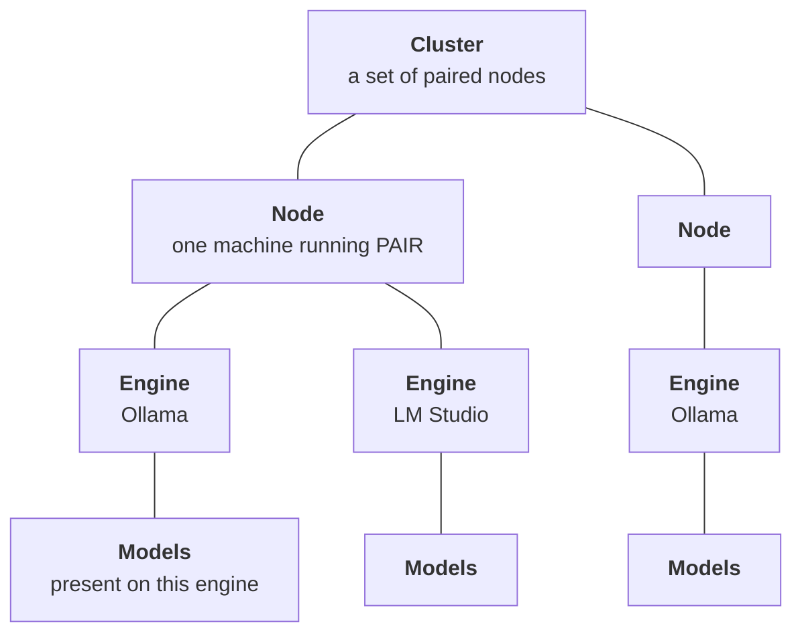
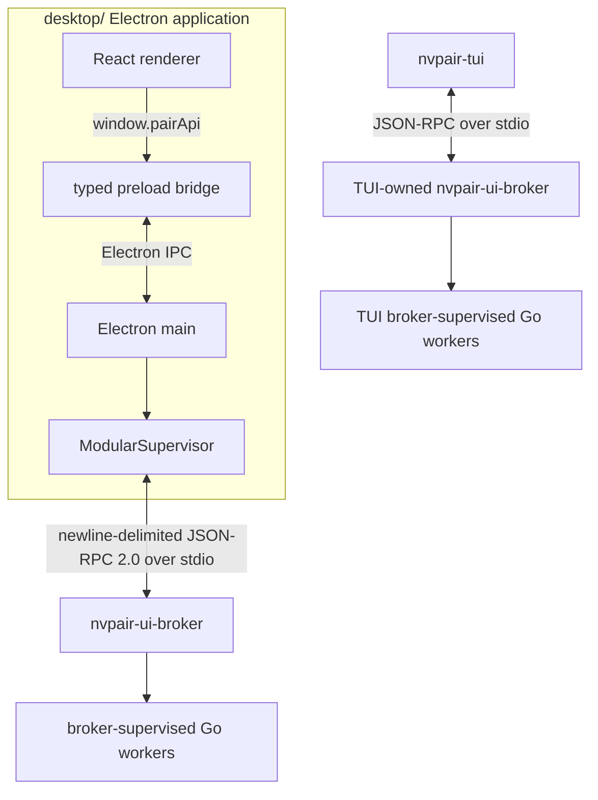
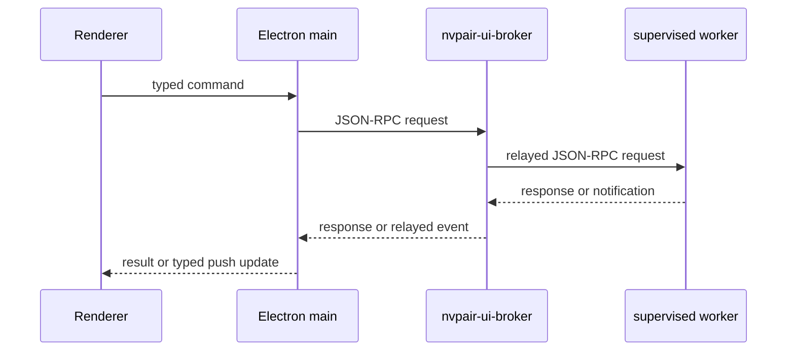
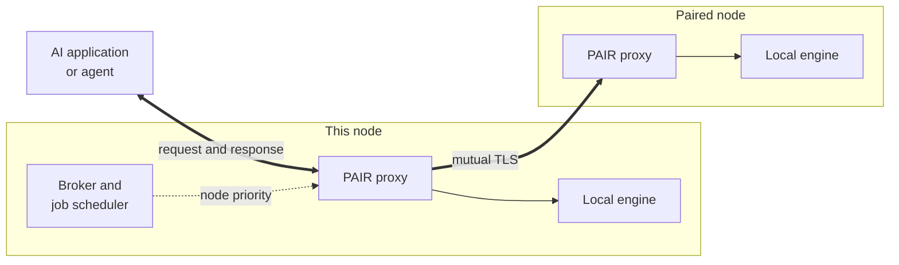
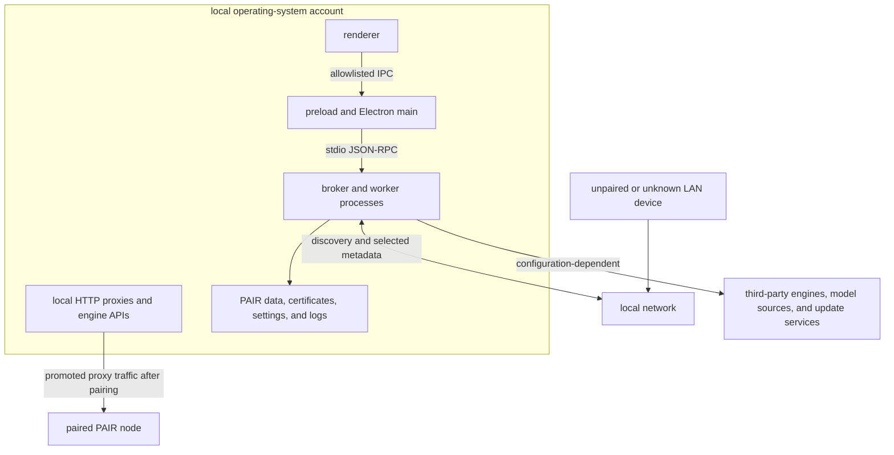

{/*
SPDX-FileCopyrightText: Copyright (c) 2026 NVIDIA CORPORATION & AFFILIATES. All rights reserved.
SPDX-License-Identifier: Apache-2.0
*/}

# NVIDIA Personal AI Router Architecture

Personal AI Router (PAIR) is a desktop-or-headless control plane around local Go
services and HTTP inference proxies. Its control traffic and inference traffic
follow separate paths.

## Cluster Shape

A cluster has four levels and a different component owns each one:

- A **cluster** is a set of nodes that have paired with each other. There is no
  founder, no primary, and membership is symmetric. A node belongs to at most
  one cluster.
- A **node** is one machine. Nodes are peers where each runs the same services, and
  each can both serve requests and route them elsewhere.
- An **engine** is an inference server on a node, Ollama or LM Studio. A node can
  run both, one, or neither, and a node with no running engine is not eligible to
  serve.
- **Models** belong to an engine on a specific node. Nothing is shared. The same
  model on two nodes is two independent copies and that duplication is what makes
  the two nodes interchangeable for a request.

PAIR evaluates eligibility at the bottom of that hierarchy. A request names a
model, so it can only be served by a node whose running engine holds it. Cluster
membership makes a node reachable. It does not make it capable.

## Process Architecture

Electron starts only `nvpair-ui-broker`. In normal operation the broker starts
the scanner and available optional workers, monitors them, reports crashes, and
attempts bounded restart with backoff. Workers log to stderr, and stdout is
reserved for newline-delimited JSON-RPC when stdio is used.

The terminal interface is a separate broker client for headless use, and is what
the `nvpair` command on PATH resolves to. Do not run it and the desktop
application on the same machine at the same time, because each starts its own
broker and worker tree and the two would then contend for the same local ports,
engines, and persisted settings.

### Health and Failure Detection

There is no `/health` endpoint on any PAIR service, and the broker does not
heartbeat its workers. What exists is uneven, so it is worth being precise about
the layers that are checked:

| Layer | How it is checked |
| --- | --- |
| Engines | A readiness probe on start, then a periodic health probe. Status carries a `healthy` flag, and a failed probe raises a service error. |
| Workers | Process liveness only. An exit is detected and restarted. A hang is not detected. |
| The broker | A `ping` request clients can call, which the terminal interface's health view uses. |
| Peer nodes | Reachability, not health: missed announcements, then recent inference activity, recent telemetry, or a probe of the node-info or engine-manager port before eviction. The inference proxies report activity but are never probed. |

Worker supervision is restart-based. An unexpected exit is retried with
exponential backoff from roughly one second to 16, with a budget of five attempts
for each unhealthy streak and a 60-second window after which a worker that
stayed up is considered recovered and its budget resets. A crash raises a sticky
error entry so the interface can show that a component is down. Recovery clears
it, and a worker that exhausts its budget is left down with the entry standing.
`nvpair-errors` is the exception that cannot report its own death, so its crashes
go to stderr instead.

The gap this leaves is a worker that is running but wedged. It is still holding its
stdio pipe, but no longer answering. Nothing detects that today. It is detected when
requests or by a UI state that quietly stops updating. To recover, restart the service from
**Settings > Service**.

## Control Flow

PAIR uses commands down and events up:

The renderer calls `window.pairApi` and preload carries those calls through
Electron inter-process communication (IPC). Electron main translates the stable
renderer contract to the broker's JSON-RPC methods. Backend notifications update
main-process state and produce typed renderer push events.

This entire path is local. The broker relays to workers on the same machine over
stdio and it is not a cluster transport. Facts about other nodes arrive through
the peer services described next, then surface as notifications on this path.

## Node-to-Node Communication

Nodes do not talk to each other over the JSON-RPC control path. Each node runs the
same set of HTTP services, and peers call those services directly. There is no
central broker for the cluster. Every node is both a client and a server.

### Transport and Authentication

Most peer traffic runs over *mutual Transport Layer Security (TLS)*. Each node
holds a stable universally unique identifier (UUID) and a self-signed leaf
certificate, and pairing pins each side's certificate against the other's UUID. A
cluster-gated endpoint verifies that its caller presents a certificate pinned for
a current member and refuses anything else, so a machine that can reach the port
but has not been paired cannot read model inventory, read workloads, or drive a
remote engine.

Certificates and pinning are owned by `nvpair-cluster-manager`. Refer to
[SECURITY.md](../SECURITY.md) for the trust model and its limits.

Not every surface is gated, and the exceptions are deliberate:

| Surface | Transport |
| --- | --- |
| Proxy, local clients | Plaintext HTTP, loopback only |
| Proxy, cluster ingress | Mutual TLS |
| Model inventory, remote engine control | Mutual TLS |
| Workload replication, error synchronization | Mutual TLS |
| Cluster membership | Mutual TLS, after pairing |
| Pairing itself | Plaintext, authenticated by the PIN |
| Host and GPU telemetry | Plaintext HTTP, **not** authenticated |

Pairing is plaintext because no trust exists yet at that point. The six-digit PIN
is what authenticates the exchange that establishes the pinned certificates.

Node telemetry is a considered trade-off, not an oversight. It is treated as the
lowest-sensitivity inter-node surface and is read by consumers that are not
cluster members, so it stays plaintext even on a clustered node. The practical
consequence is that hostname, hardware inventory, and utilization for a node
running PAIR are readable by anything on the same subnet that asks. Do not run
PAIR on a network where that is unacceptable.

### Two Personalities on One Port

The proxies and `nvpair-cluster-manager` serve two different things on a single
port, chosen by the connection's first byte. A TLS handshake record starts with
`0x16`, and no HTTP method does:

| First Byte | Personality | Who Uses It |
| --- | --- | --- |
| Not `0x16` | Plaintext HTTP, loopback only | Your local applications |
| `0x16` | Mutual TLS | Paired nodes in the cluster |

This is why an endpoint is `http://127.0.0.1:11434` for an application on the
machine itself while the same port serves authenticated TLS to the network. Local
clients need no certificates, and routed inference between nodes is never
plaintext.

The loopback restriction is enforced, not merely conventional. The listener binds
all interfaces so the TLS personality can accept peers, but a plaintext request
from any non-loopback address is refused with `403`. Without that check the port
would be an open relay for anything on the network.

Two consequences follow, and together they define how clients are expected to
reach PAIR:

- **A machine that is not a node has no way in.** It cannot use the plaintext
  personality, because it is not loopback, and it cannot use the TLS personality,
  because it holds no pinned cluster certificate. Pointing an application at
  another machine's proxy port does not work by design.
- **A peer request is served, not re-routed.** The mTLS ingress forwards straight
  to that node's own engine and never re-enters candidate selection, so a peer
  cannot chain a request onward through a third node.

The second point is why the routing decision belongs to the machine the request
originates on. To give a workstation the whole cluster, make it a node. After it is a node, its local
proxy then routes on its behalf, whether or not it runs an engine itself.

### What Peers Exchange

Beyond routed inference, the peer services replicate the state the interface
shows:

- Host and GPU telemetry
- Per-node model inventory, so the proxy can judge a node eligible for a request
- Workload events, so every node can show jobs running anywhere in the cluster
- Service errors, so a failure on one node is visible from another
- Cluster-scoped engine control, for operating a remote node's engine

Each of these listens on its own port. Refer to the [port map](#port-map) below.

Electron polls every discovered node's `/v1/node-info` directly because that
detail is richer than the broker's control surface exposes. Healthy nodes are
sampled every two seconds; consecutive failures back off to 4, 8, 16, then 30
seconds and reset on success. This is the one place Electron makes service-data
HTTP calls of its own. Separately, the backend scanner samples a compact
maximum-GPU utilization value for scheduling with the same healthy cadence and
capped failure backoff, which the broker relays straight to the job scheduler.
Routing never depends on renderer metrics.

## Inference Data Flow

Inference HTTP does not travel through the renderer-to-broker JSON-RPC path.

Responses stream back along the same path they arrived on. One request goes to one
node and the proxy never splits it.

Engines started by PAIR bind to loopback, so a peer never reaches another node's
engine directly. It goes through that node's proxy, which is the only
cluster-facing entry point.

### How a Node Is Chosen

The proxy owns the per-request decision, and it does not produce a single winner.
It produces an **ordered failover list** of nodes eligible for that request, then
walks it.

For model-bearing inference, eligibility is a hard gate: the proxy takes a
request-local copy of the latest discovery snapshot and keeps only nodes whose
per-engine inventory advertises the requested model. Within that owner set, or
across all candidates when the request has no parsed model, the order is:

1. **A manually selected node**, if one is pinned.
2. **The scheduler's priority order**, which is the normal case.
3. **Remaining nodes by stable node ID**, so cold start and unlisted nodes are
   predictable rather than random.

Manual selection is a proxy capability rather than a desktop feature. The desktop
application never pins a node. It renders routing state and lets the scheduler
decide. The only way to pin one today is the terminal interface's **Proxies** tab,
which selects a node with `enter` and returns to automatic with `a`. Treat
automatic routing as the normal case.

<Note>
A pin cannot override model eligibility. If the pinned node does not advertise
the requested model, automatic ordering continues among the advertised owners.
</Note>

This is why the broker and the scheduler appear in the diagram. Neither touches
the request, and their only job is to keep the proxy's preference order current.
`nvpair-job-scheduler` holds no socket and never talks to another node, so an
ordering reaches a proxy in three steps:

1. The broker feeds the scheduler every workload transition it accepts, locally
   or from a peer, plus compact GPU telemetry from discovery.
2. The scheduler ranks the nodes and hands the ordering back.
3. The broker relays that ordering to each proxy.

The ranking combines *pending work and GPU pressure*. A workload counts as
pending while it is queued or running, and it is attributed to the node it was
placed on. Both engines count together, so Ollama load affects LM Studio ordering
and vice versa.

GPU pressure is deliberately coarse. The scheduler smooths the busiest GPU's
utilization, maps it to 0–3 pressure units at 40%, 70%, and 85%, and uses lower
thresholds on the way down to avoid rank thrash. Missing, invalid, or
older-than-ten-second telemetry contributes a neutral pressure of 1. Nodes sort
by pending plus pressure, then by pressure, then by node ID, which makes cold
start deterministic. Rankings recompute when a meaningful input changes,
reconcile on a one-second timer, and are only published when the order, the
counts, or the pressure changed.

Ranking cannot close one gap on its own. A node's pending count only rises after
its workload report arrives, so requests dispatched at the same moment would all
see the same idle node and pile onto it. To prevent that, each proxy adds the
requests it has just dispatched itself to its own estimate and reserves its
choice before forwarding, so a burst spreads without waiting for those reports.

### Models Do Not Need to Be on Every Node

**You do not have to put the same models on every node.** A cluster where one
machine holds a large model and another holds a small one is a supported and
sensible configuration. The proxy matches each request to the nodes that can
serve it.

The important thing to understand is that the scheduler and the model matching are
two different mechanisms, and they compose in one direction:

- **The scheduler is model-blind.** It ranks every node by pending work and GPU
  pressure. It does not know which models exist where, and its ordering never
  mentions a model.
- **The proxy enforces model capability.** It removes nodes that do not advertise
  the requested model, then applies the scheduler's ordering to the remaining
  owners.

So load balancing happens **among the nodes that can serve the request**, not
across the cluster as a whole.

#### Capability Gate

When an inference request contains a non-empty model, only nodes whose current
inventory for that engine advertises the model enter the failover list. An empty
inventory and an inventory that lists other models are both ineligible. Ollama's
implicit `:latest` tag is normalized; LM Studio model IDs match exactly.

If no advertised owner is routable, the proxy returns an actionable local `502`
without sending the request to an engine. It does not broaden the candidate list
or refresh inventory synchronously; a later discovery update makes a newly
advertised owner eligible.

A request whose model cannot be parsed keeps the ordinary non-model ordering.

Model listings are not routed at all. A `GET` of `/v1/models` or `/api/tags` is
fanned out to every candidate concurrently and the replies are merged, which is
why the answer is the cluster's inventory rather than one node's.

#### Failover and Inventory Freshness

An advertised owner's inventory can still become stale after candidate
selection. If that owner answers inference with `404`, the proxy treats it as
retryable and moves to the next advertised owner. It never fails over to an
unknown or known-missing node. Genuine client errors such as `400` or `422` are
not retried, because they would fail identically everywhere.

#### Planning Model Placement

Where you put each model decides what routing can do with it:

- **One copy of a model means no balancing for it.** Every request naming it goes
  to the node advertising it, however loaded that node is, because no peer can
  be substituted.
- **Preparing a model on more nodes is what gives the scheduler room.** With the
  same model advertised on three nodes, the scheduler's GPU-aware load order
  decides among them. This is the reason to duplicate a model, and the only
  thing that makes those nodes interchangeable.
- **Mixed inventories work.** Node A can hold a 70B model and node B a 7B one.
  Requests for each are steered to the node that has it, and neither blocks the
  other.
- **A model on a node with no running engine does not count.** Eligibility needs
  a running engine as well as the model. Refer to the earlier hierarchy.
- **Where work actually ran is observable.** Use the **Jobs** view rather than
  inferring routing from inventory.

### Scheduler Limitations

There is one policy today and it combines job count with coarse GPU utilization.
That is useful load feedback rather than a complete capacity model. These are the
known limitations, stated plainly so you can predict where routing falls short.

**It sees pressure, not capacity.** GPU model, available VRAM, and measured
latency are not inputs. The same utilization percentage maps to the same pressure
on a small and a large GPU, so a mixed cluster can still favor a slower machine.
Missing or stale telemetry is neutral rather than treated as idle.

**Multi-GPU nodes use the busiest device.** The compact telemetry feed reports
the maximum utilization across GPUs. That conservative choice avoids steering
more work to a node with one saturated device, but the scheduler does not know
which engine or model uses which GPU and can overlook idle capacity elsewhere on
the same node.

**Every workload counts as one.** A three-token completion and a long generation
are the same unit of pending work, so "fewest jobs" is not "least busy." A node
running one enormous request looks more idle than a node running two trivial ones.

**Model load state is not considered.** Eligibility asks whether a node *has* the
model, not whether it is already loaded in memory. PAIR knows which models are
loaded, and the interface shows it, but routing does not use it, so a request can
be sent to a node that must cold-load the model while a node holding it warm sits
one place lower in the order.

**Only work PAIR routed contributes to pending counts.** Inference sent straight
to an engine's own port is absent from workload events. GPU-heavy external work
can still raise pressure, but CPU-only work and queued demand remain invisible.

**Both engines are counted as one pool.** Ollama and LM Studio load is summed,
and maximum GPU pressure applies to the whole node. That is conservative on a
typical single-GPU machine and can underuse a multi-GPU node where the engines
occupy different devices.

**Every node ranks from its own view, and views lag.** There is no shared
schedule. Two nodes dispatching at the same moment can briefly steer work to the
same idle peer, because each sees an eventually consistent picture and a peer's
counts trail by relay latency. Per-proxy reservations cover the local burst case,
but they are local: one node cannot see what another just dispatched. The system
self-corrects through workload relay and periodic reconciliation rather than
preventing the collision.

**Unranked nodes fall back to identity order.** A node the scheduler has not
ranked yet is ordered by node ID, which has nothing to do with load. That happens
at cold start, or for a manual proxy target the scheduler's discovery never saw.
The fallback degrades ranking quality without causing a misroute. Missing
telemetry for a ranked node is different: that node takes the neutral pressure
value and stays in the normal ranking.

Improving this, and likely offering a choice of policies, is planned work. Which
of these gaps matters most depends on the hardware people actually run, so
reports from real deployments are more useful than guesses. Refer to
[Where PAIR is going](../README.md#where-pair-is-going).

## Engines and Ports

`nvpair-engine-manager` owns everything about a local engine except serving
inference. It finds the engine, installs it, starts and stops it, and chooses the
port it listens on.

### Finding an Engine

PAIR does not assume it installed the engine. Detection checks the manifest's
known install locations for each engine, so an Ollama or LM Studio you installed
yourself is found where it already is. "Installing" an engine that is already
present downloads nothing and reports it as installed.

Starting is similarly deferential. If something is already serving the engine's
port, PAIR **adopts** that instance instead of spawning a second copy, and reports
it as running even though it did not start it.

Adoption is a real distinction, not a label. PAIR cannot stop or move a process
it did not start, so it refuses operations that need process ownership rather
than faking them. Changing the port of an adopted engine returns an error
instead of leaving two listeners on different ports. To get an instance PAIR can
fully manage, stop the engine in its own application and let PAIR start it on a
port nothing else is serving.

### Port Takeover

An application that already works with Ollama is configured for `11434`. If PAIR
listened somewhere else, every tool would need reconfiguring to gain anything, so
PAIR inverts it: the **proxy** takes the port the engine would normally use, and
the engine moves behind it — Ollama to `11435` and upwards, LM Studio to `1235`
and upwards. Existing clients keep working untouched and transparently gain the
cluster.

This is also what makes the engine unreachable from outside. Engines PAIR starts
bind to loopback, so the only network-facing listener is the proxy, which is where
cluster authentication lives.

An inherited `OLLAMA_HOST` naming a different local plaintext port is honored as
well. The broker gives the proxy that normalized loopback-only alias, reserved
against every engine and both proxies' port plans so a relocating engine can never
land on it. `localhost` claims IPv4 and IPv6 together, and remote and HTTPS
targets are never intercepted. Clients already configured through the variable
therefore enter the same routing path without being reconfigured.

The rearrangement is conditional, and PAIR yields rather than fights:

- An **unknown process** is never moved or killed, whatever is holding the port.
- A running engine PAIR **adopted** is left alone when the only way to move it
  would be to kill its process. Ollama works this way. Where the engine publishes
  an official stop command, as LM Studio does with `lms server stop`, PAIR can use
  that command to stop it and bring it back on the configured port.
- If the engine is already running on the compatibility port, PAIR does not take
  that port. The proxy stays where it is and the takeover is reported as blocked.
- If anything else holds the port, the outcome is the same. PAIR steers the proxy
  to a free port and raises a warning rather than forcing a conflict.

The practical consequence is the one in
[Troubleshooting](troubleshooting.mdx#requests-work-but-pair-shows-no-jobs). Start
the Ollama desktop application and it takes `11434` for itself, so PAIR cannot,
and requests reach that local Ollama without ever being routed.

### Port Map

A default installation listens on these ports:

| Port | Listener |
| --- | --- |
| `11434` | Ollama-compatible proxy (Ollama itself moves to `11435`+) |
| `1234` | OpenAI-compatible proxy (LM Studio moves to `1235`+) |
| `14318` | Node hardware and model inventory |
| `14319` | Service-error synchronization between nodes |
| `14320` | Workload propagation between nodes |
| `14321` | Pairing and cluster membership |
| `14322` | Model list served to cluster peers |
| `14323` | Cluster-scoped remote engine control |

The `143xx` listeners are the peer surfaces from
[Node-to-Node Communication](#node-to-node-communication). Their numbers are
fixed, so the broker can tell a worker which port to serve without a handshake.

The components that own proxy and engine ports persist them and restore them on
the next start, so a port a user chose survives a restart. Refer to
[Ports](getting-started.mdx#7-connecting-your-agents-and-port-information) for how
to change one.

## Discovery and Identity

`nvpair-node-scanner` is the single place a host advertises itself and the single
place it learns about the LAN. Other services register their ports with it rather
than advertising separately, and consumers subscribe to its directory rather than
browsing themselves.

### One Record for Each Node

The scanner advertises one `_nvpair-node._tcp` multicast DNS (mDNS) record for
each host, and that record carries two kinds of content:

- The ports its sibling services registered: node-info, both proxies, errors,
  workloads, cluster manager, and engine manager
- The node's identity: `uuid=`, `cluster-uuid=` after clustering, and where to
  reach it — `ip=` for the address the node ranks first, and `ips=` for the whole
  ranked list

Publishing the list rather than one address is what lets a peer keep trying. A
machine can be reachable on one interface and not another, so a peer works
through the candidates instead of giving up on the first, and remembers the one
that answered.

One consolidated record instead of one for each service is a deliberate
constraint. mDNS TXT records are small, so per-service records would not hold the
payload. Bulky facts like the model list are fetched over HTTP afterwards instead
of being crammed into TXT.

### Node Identity

PAIR identifies every node by a stable UUID, never by its hostname.

An mDNS instance name defaults to the hostname, so two machines that share one
would silently merge into a single node. Every service therefore advertises a
per-host UUID, and the directory is keyed by it.

That UUID is the correlation key across the entire system: discovery entries,
cluster membership, workload attribution, error reports, telemetry, and proxy
routing all resolve against it. Hostnames are display only. A machine can be
renamed without becoming a different node, and a duplicated hostname does not
collapse two machines into one.

The UUID reuses the cluster manager's persisted identity when that exists, so one
host presents the same UUID everywhere. If the cluster manager has never run, the
scanner mints one and persists it.

### Sharing UDP 5353

PAIR runs its own mDNS responder rather than depending on a system one, because
Windows ships none. That responder must coexist with whatever else is on the
port, including Bonjour, Avahi, and PAIR's own sibling processes. It therefore
sets `SO_REUSEADDR` on the socket to share UDP 5353.

It deliberately does **not** set `SO_REUSEPORT`. On Linux that load-balances
incoming unicast datagrams across every socket sharing the port, which would let
one process swallow mDNS replies meant for another.

### Node Enrichment

Announcements establish that a node exists and which ports it serves. PAIR
fetches the interesting facts afterwards, for each node, over HTTP:

- GPU, CPU, and memory inventory from its node-info port
- Its model list from its engine-manager port, as a flat union, a per-engine
  breakdown, and the per-engine set of models currently loaded in memory

Each enrichment keeps a last-good value, so one failed fetch dims nothing. A
node's card does not blank out because a single poll timed out.

With a cluster directory configured, a browsed peer whose `cluster-uuid=` matches
a pin this node holds is annotated as trusted, which is how the interface can
distinguish a paired node from a stranger it can merely see.

### Node Eviction

The scanner scans every five seconds and tolerates three consecutive misses
before it treats a node as gone. Even then it does not drop the node right away.
It runs these checks and keeps the node if any of them answers:

- Inference the node served in the last minute, which the proxies report
- Recent telemetry from that node
- A direct request to the node's node-info endpoint
- A probe of the engine-manager port

The activity check comes first because a node under load is the one most likely
to miss an announcement, and evicting it would pull a working machine out of the
routing pool at its busiest.

The remaining checks deliberately avoid the inference proxy ports. Those ports
exist to serve requests, and using them as a liveness test would put connection
attempts on the serving path every time multicast dropped a packet.

Multicast is lossy, and Wi-Fi, VPN adapters, and sleeping network interfaces all
produce gaps that have nothing to do with a node's health. Without that probe a
momentary gap would evict a perfectly healthy node and take its models out of the
routing pool.

Discovery holds record replacement to the same standard. A node can reappear with
a new identity, for example after a reset. The old entry then looks superseded,
and leaving both in place would list the machine twice. But a matching address
and hostname arrive in an unauthenticated announcement that anything on the
network can send, so those signals only mark the old record as a suspect.
Discovery confirms the node's identity before dropping that record. A stale
duplicate therefore cannot linger, and nothing can displace a peer by claiming
its address.

### Manual Nodes

Some networks block or filter multicast, so discovery is not the only path in.
`nvpair-manual-nodes` takes an address you enter directly and probes it on a
fixed interval, and a manual node that answers is folded into the same directory
as a discovered one. It is initially keyed by the address you typed, and re-keyed
to the peer's real UUID as soon as that node reports it.

## Trust Boundaries

The important boundaries are:

1. **Renderer to Electron main.** Preload exposes allowlisted APIs. Electron
   main owns native operations and subprocess lifecycle.
2. **Electron or terminal interface to broker.** Stdio has one parent peer.
   Optional socket or named-pipe mode relies on operating-system endpoint
   permissions. JSON-RPC has no independent per-message token.
3. **Loopback HTTP.** Local clients can submit sensitive inference content.
   Listener addresses, browser access, CORS, and host account security matter.
4. **LAN discovery and metadata.** The network can reveal service presence and
   selected host information. Some enrichment endpoints use plain HTTP.
5. **Pairing bootstrap.** A six-digit PIN bootstraps certificate trust. It is a
   convenience code, not a high-entropy long-term authenticator.
6. **Cluster boundary.** Cluster-scoped workers and promoted proxy ingress are
   designed to use pinned certificates and mutual TLS after pairing. This does
   not protect every local or discovery endpoint.
7. **Third-party boundary.** Engines, models, catalogs, and update mechanisms
   have their own network behavior and terms.

Refer to [SECURITY.md](../SECURITY.md) for deployment assumptions and reporting.

## Building the Two Trees

`services/` is the source of the Go binaries, and `desktop/` consumes them. The
desktop build compiles the sibling tree directly.

| Build In | Output | Contents |
| --- | --- | --- |
| `desktop/` | `desktop/cli-bin/` | What the app supervises, one OS/arch |
| `services/` | `services/build/bin/` | All 13 executables, for standalone use |

`desktop/scripts/build-modular-binaries.ts` compiles the runtime inventory for a
selected target and writes a manifest recording the source identity, versions,
target, file sizes, and hashes. It rejects unexpected files in `cli-bin/`, so a
stale or hand-placed binary is caught rather than silently supervised.

`services/build.sh` and `services/build.bat` stage every executable together,
stamped from `versions.json`. Building one component by hand without restaging is
the one thing to avoid: the broker keeps running whatever is in `build/bin/`.

Both paths produce binaries you run on the machine that built them. This tree
provides build materials only. There is no packaging, installer, or signing step
here, and installable builds come from the
[releases page](https://github.com/NVIDIA/Personal-AI-Router/releases). Refer to
[Building PAIR](building.mdx).

## Authoritative Files

When this document and the code disagree, these files decide:

- Desktop process model: `desktop/docs/architecture.md`
- Renderer API: `desktop/docs/frontend-api.md`
- Runtime inventory: `desktop/src/shared/constants/modular-binaries.ts`
- Broker API and worker ownership: `services/nvpair-ui-broker/README.md`
- Services versions: `services/versions.json`
- Building: `desktop/package.json`, `services/build.sh`, and
  `services/build.bat`
