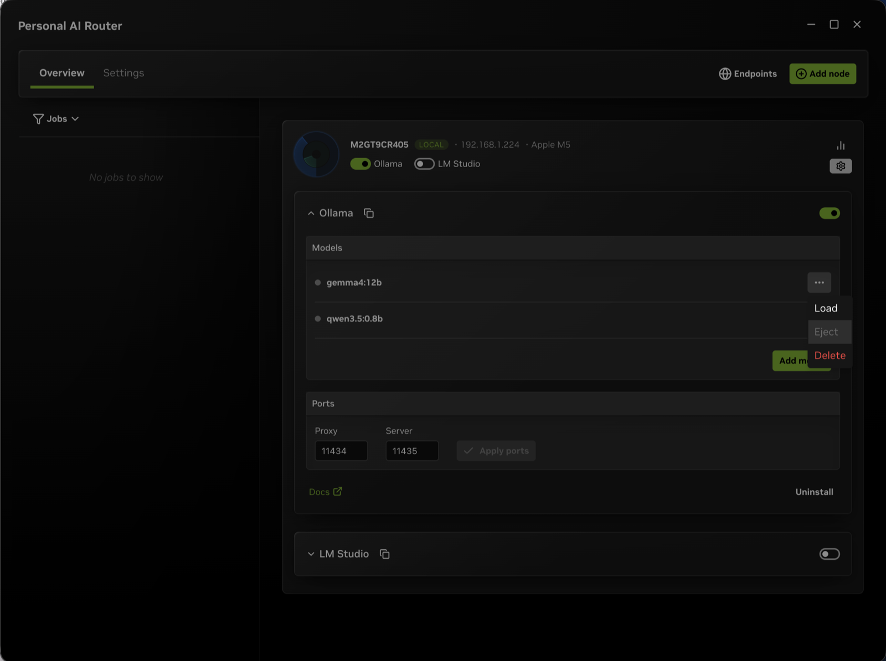

{/*
SPDX-FileCopyrightText: Copyright (c) 2026 NVIDIA CORPORATION & AFFILIATES. All rights reserved.
SPDX-License-Identifier: Apache-2.0
*/}

# Managing Engines in NVIDIA Personal AI Router

An **engine** is the local inference runtime Personal AI Router (PAIR) uses to
run models. Today that means Ollama or LM Studio on a given machine. PAIR can
install and run those engines for you, or work with a copy you already have.
This page explains what you can expect when you install, start, stop, update, or
remove an engine.

For first-time setup, refer to [Getting started](getting-started.mdx). If
something does not start, refer to [Troubleshooting](troubleshooting.mdx).

## Engine Requirements

PAIR does not run models by itself. Each participating machine needs at least
one compatible engine that is:

1. **Installed**, or adopted from an existing install.
2. **Running**.
3. Holding the **model** your request needs.

A request only goes to a machine when that machine is online, an eligible
engine is running there, and the requested model is available on it.

## Managing Engines

You can manage the engine using the UI or the terminal.

In the desktop application:

1. Open **Overview**.
2. Select a machine (node).
3. Use that node's **Engine settings**.

From there you can install or remove an engine, turn it on or off, change its
port when PAIR manages it, download models, and review progress while long
operations run.

These actions need the UI:

- Listing, loading, ejecting, and deleting models
- Updating an engine
- Managing another node's engines

In the terminal:

On a machine with no desktop, the [terminal interface](terminal-interface.mdx)
handles these engine lifecycle actions:

- Install an engine.
- Start an engine.
- Stop an engine.
- Restart an engine.
- Uninstall an engine.
- Pull a model.

It does not do everything that the application does.

Check that the terminal interface covers your workflow before relying on it.
Refer also to [Getting started](getting-started.mdx).

## Installing an Engine

You can install a supported engine during first-run setup or later from
**Engine settings**.

When you install an engine, consider the following:

- Choosing install makes it an **NVPAIR-installed** engine. PAIR downloads it,
  configures it, and owns it from then on.
- A successful install **starts the engine** as part of the same flow, so you
  normally do not need a separate start step right after install.
- If Ollama or LM Studio is already running on the machine, PAIR can **adopt**
  that install instead of downloading another copy. Adoption helps when the
  usual engine port is already in use.

To download models:

1. Use **Add model**.
2. Use **Load** when the engine requires an explicit load.

## Starting and Stopping an Engine

Use the engine switch in **Engine settings** to start or stop an NVPAIR-installed
engine.

- **Start** brings the engine up and marks it as something PAIR should keep
  running for you across relaunches. Refer to
  [What Persists Across Restarts](#what-persists-across-restarts).
- **Stop** turns it off and remembers that you want it off.
- Progress and status update live on the Overview and engine views. Wait for the
  switch and status text to settle before assuming the change failed.

An engine must be **running** before **Endpoints** or your applications can use
its models. If **Endpoints** says **No engines are running**, start an engine
first.

## Updating and Uninstalling an Engine

Both actions apply only to an engine PAIR installed:

- **Update** (when offered) updates an NVPAIR-installed engine, and like install
  it usually leaves the engine running. PAIR only updates engines it installed.
  It leaves one you installed yourself alone, though it may offer an NVPAIR
  install alongside it.
- **Uninstall** removes the NVPAIR-installed copy of that engine. Use it when you
  no longer want PAIR to own that engine on the machine.

Uninstalling an engine does **not** remove its models. Downloaded model files stay
on disk, in the engine's own storage such as `~/.ollama`, so uninstalling and
reinstalling does not cost you re-downloading them. To reclaim that space, delete
the models through the engine, or remove its data directory yourself.

Port changes for an NVPAIR-installed engine also live in **Engine settings**.
Prefer the controls in PAIR over editing the engine's own config when PAIR is
managing it. If PAIR **adopted** an engine that was already running, meaning it
did not start the process, what it can do depends on how that engine is
controlled:

- **Ollama** is managed as a process, so PAIR will not move an adopted one. It
  refuses the port change rather than killing something it did not start. Stop
  the engine in its own application first if you want PAIR to manage it fully.
- **LM Studio** publishes an official stop command, so PAIR can stop an adopted
  instance that way and restart it on the port you chose.

Refer to [Engines and Ports](architecture.mdx#engines-and-ports) in the
architecture guide.

## Managing Engines on Other Machines

After systems are paired, you can view another machine's engines from
**Overview** and, where supported, start or stop engines and pull models on that
peer.

Some actions stay **local only** on each machine, for example uninstall, update,
and changing ports. Perform those on the machine that owns the engine, or connect
to that machine's PAIR application or terminal interface.

Everything you change is scoped to one machine. A port you set on this node moves
that node's engine and nothing else. The other nodes keep the ports they already
had, and PAIR does not push the value across the cluster. Installing, updating,
and uninstalling work the same way, because each is a decision about one machine.
This is why the endpoint to use is the one shown on the machine you are working
at, rather than a port you remember from somewhere else.

Both sides still need the same model available if you want either machine to be
eligible for a given request.

## What Persists Across Restarts

PAIR remembers whether each local NVPAIR-installed engine should be on or off.

- When you quit or restart PAIR, it stops running engines cleanly as part of
  shutdown.
- The next time PAIR starts, it restores engines that were left **on**, so you
  do not have to flip every switch again.
- On the **first** open of the application on a machine, PAIR also starts
  engines that are already installed once, so a fresh setup is ready to use.

If you stopped an engine on purpose, it stays stopped after relaunch until you
start it again.

## Working with Models

The lifecycle of the **engine** (install, start, and stop) is separate from
working with **models** (download, load, unload, and delete):

| Goal | Instructions |
| ---- | ------------ |
| Get the runtime on the machine | **Install** on the engine's card |
| Make the runtime available for requests | The engine switch |
| Get a model's weights onto the machine | **Add model** |
| Hold a model in memory, when the engine needs it | **Load** |
| Free that memory without deleting anything | **Eject** |
| Remove a downloaded model | **Delete**, where the engine supports it |

**Eject** removes a model from memory only. The download stays, and **Load**
brings it back without fetching it again.

On a headless machine the terminal interface covers installing, starting,
stopping, restarting, and uninstalling an engine, and pulling a model. Operations
it does not have, such as deleting a model or updating an engine, need the
desktop application on that machine.

PAIR does **not** warm models. Starting an engine does not pre-load models into
memory, and it holds nothing ready in advance. Depending on the engine, a model
loads when you load it explicitly or when a request needs it. The first request
to a cold model can therefore take longer.

You can **delete** individual models from **Engine settings** when that engine
exposes delete. That is not the same as uninstalling the engine. **Delete**
removes one model's files through the engine, while **Uninstall** removes the
NVPAIR-installed engine and leaves every model in place. PAIR has no action that
uninstalls every model at once.

Applications need a **running** engine plus an available model. Copy API URLs
from **Endpoints** after an engine is running. Do not assume a fixed port such as
`11434` or `1234`.

## Tips

These habits avoid the most common engine problems:

- Install PAIR and prepare engines on **every** machine that should serve work.
- To spread work across a cluster, put the **same model** on each eligible
  machine and keep a compatible engine running there.
- Prefer PAIR's engine controls for an NVPAIR-installed engine. Editing it by
  hand alongside them can confuse ports and status.
- If an engine switch or install seems stuck, open **Settings > Service**, check
  service health and logs, then retry. Refer to
  [Troubleshooting](troubleshooting.mdx).

## Related Documentation

These pages cover the surrounding workflows:

- [Getting started](getting-started.mdx)
- [Terminal interface](terminal-interface.mdx)
- [Troubleshooting](troubleshooting.mdx)
- [Overview](overview.mdx)
- [Architecture](architecture.mdx) (how engines fit into PAIR's process model)
