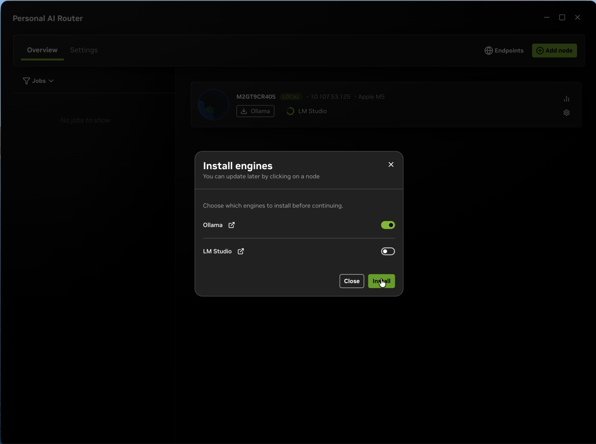
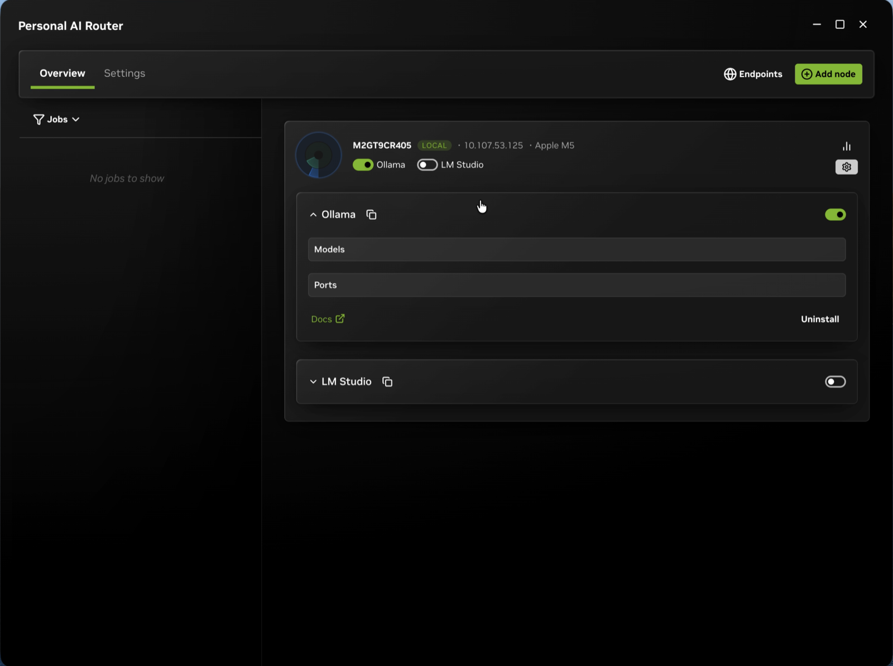
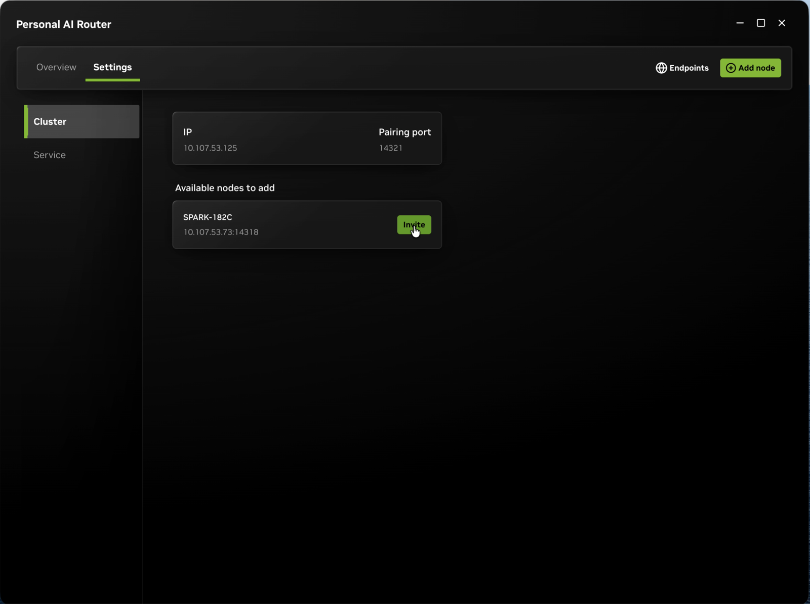
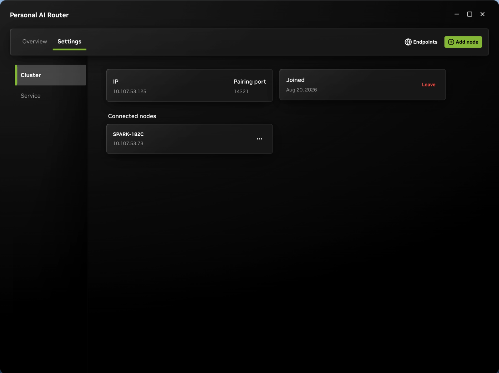
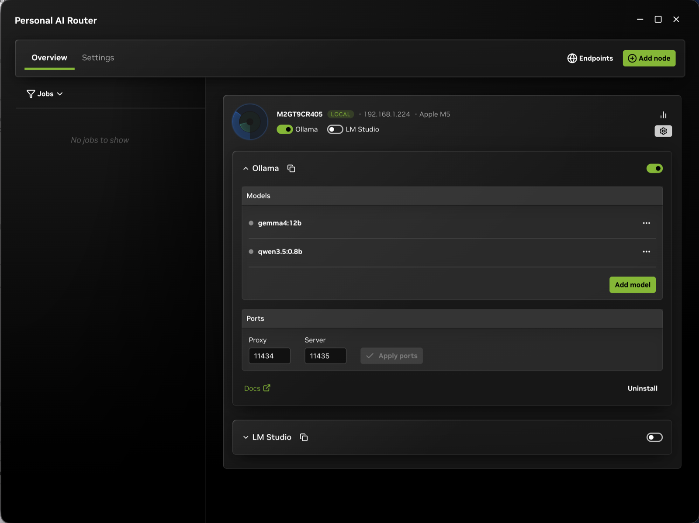
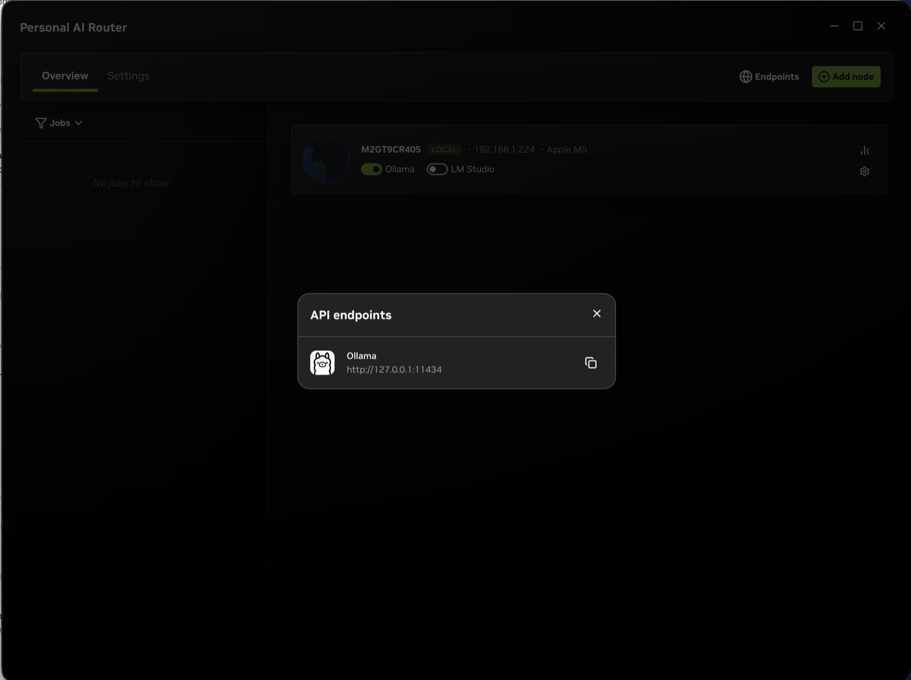
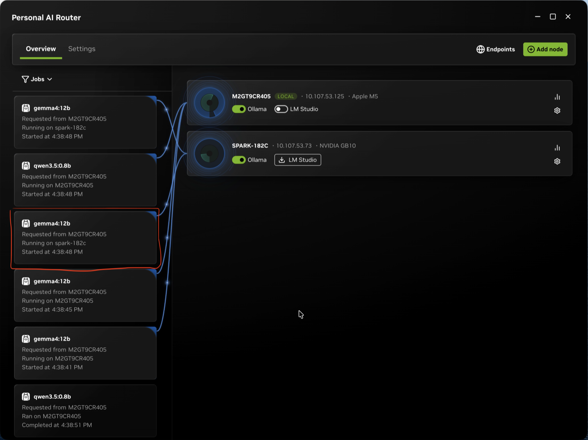
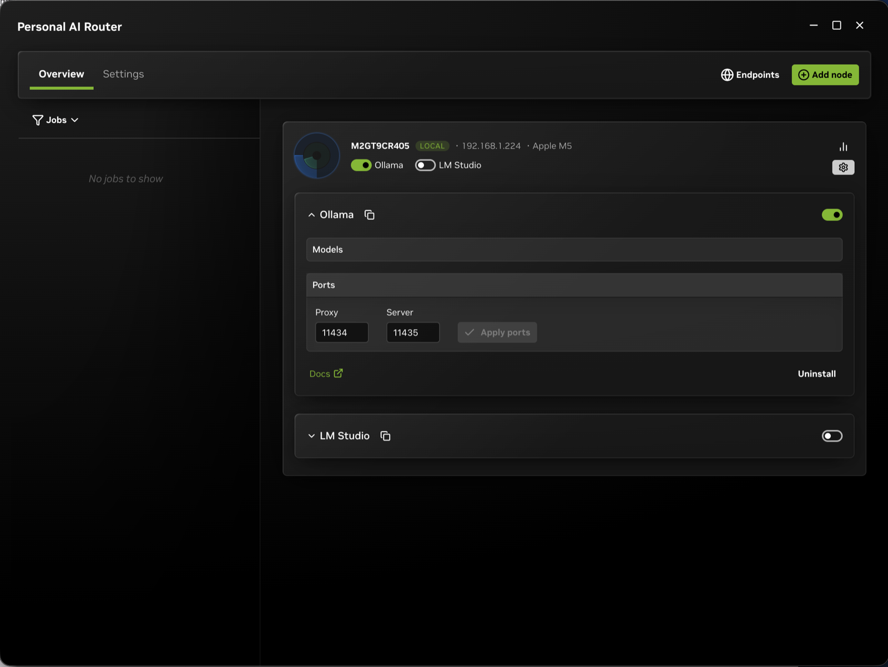
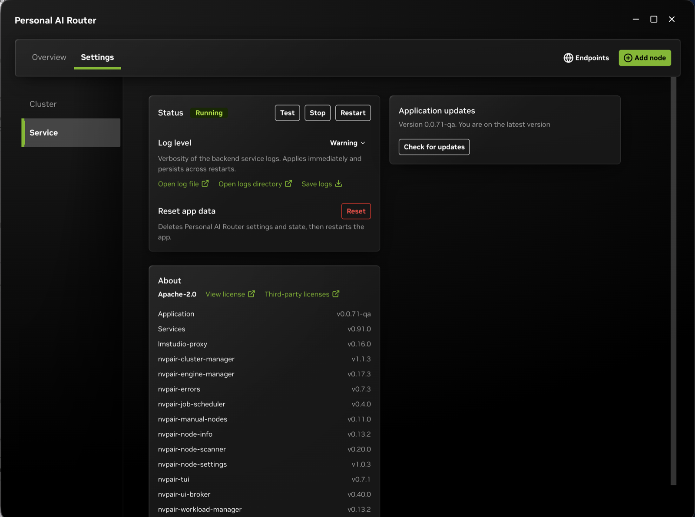

{/*
SPDX-FileCopyrightText: Copyright (c) 2026 NVIDIA CORPORATION & AFFILIATES. All rights reserved.
SPDX-License-Identifier: Apache-2.0
*/}

# Getting Started with NVIDIA Personal AI Router

NVIDIA Personal AI Router (PAIR) connects compatible systems on the same local
network and routes independent inference requests to a node that can serve them.
Install PAIR on each participating system, pair the systems, enable an inference
engine, and then point compatible applications at PAIR's local endpoint.

> PAIR routes each request to one node. It does not pool GPU memory, combine
> GPUs into a larger logical GPU, or split one model or request across systems.

If a step does not go as described stop and check
[Troubleshooting](troubleshooting.mdx). For example, nothing starts, no nodes appear, pairing
stalls, or an application cannot connect. It is organized by symptom, so you can go
straight to the one you are seeing.

> **Setting PAIR up on a system with no desktop?** The desktop application needs
> a graphical session, so a headless system is driven from PAIR's terminal
> interface instead. Follow
> [Using the PAIR terminal interface](terminal-interface.mdx), which covers
> starting PAIR, pairing, engines, models, and monitoring from a terminal. The
> rest of this guide describes the desktop application.

## Before You Begin

All you need is a machine to install PAIR on. One machine is enough to run local
inference; two or more on the same local network let you try pairing and routing.

Nothing else has to be in place first:

- **Engines.** PAIR installs and starts Ollama or LM Studio for you in step 4. If
  an engine is already installed, PAIR detects and uses it instead.
- **Models.** PAIR downloads models for you in step 4. A request needs only one
  eligible node, so a single node holding the model is enough. Prepare the same
  model on additional nodes when you want any of them to be able to serve it.
- **Firewall.** The Windows installer adds the rules PAIR needs, and typical
  Linux desktop configurations do not block local traffic. If you run a
  restrictive firewall, allow the ports listed in
  [step 7](#7-connecting-your-agents-and-port-information) so nodes can discover
  and reach each other.

## 1. Install PAIR

Download the appropriate asset from the
[PAIR releases page](https://github.com/NVIDIA/Personal-AI-Router/releases).

Choose from:

- **Windows installer:** Download and run the Windows installer, then launch
  NVIDIA Personal AI Router from the Start menu.
- **Debian package:** Download the package, then run this from the directory you
  downloaded it into:

  ```bash
  sudo apt install ./NVPAIR-Setup-*.deb
  ```

  Then launch NVIDIA Personal AI Router from the desktop application menu. If
  you have kept more than one PAIR package in that directory, install the one
  you want by its full filename instead.
- **macOS disk image:** Open the `.dmg` and drag NVIDIA Personal AI Router to
  **Applications**, then launch it from there.

The releases page also carries an archive of the background services and the
terminal interface for each platform. It contains no desktop application, so it
is the headless option rather than another way to install this one. Refer to
[Using the PAIR terminal interface](terminal-interface.mdx).

### Quick Start From Source

If you prefer to compile PAIR, install the prerequisites listed under
[Prerequisites](building.mdx#prerequisites), then:

```bash
git clone https://github.com/NVIDIA/Personal-AI-Router.git
cd Personal-AI-Router/desktop
npm install
npm start
```

`npm start` builds the Go services from sibling `../services`, prepares the
desktop assets, and launches the desktop application. No separate services build
is required.

Install or start PAIR on every system that will participate. Refer to
[Building and running PAIR from source](building.mdx) for standalone service
builds and for running the services directly.

## 2. Complete First-Run Setup

On first launch, PAIR opens a setup window that can install available inference
engines on the local system. PAIR selects Ollama by default when it is available
for your platform.

1. Review the available engines.
2. Select the engines to install, or skip installation if they are already
   managed separately.
3. Finish the setup and wait for the selected engine to report that it is
   running.



The first start takes a little longer than later ones, because PAIR is starting
its background services for the first time. If **Overview** is still showing
**Loading...** after a minute or two, something did not come up. Refer to
[PAIR Does Not Become Ready](troubleshooting.mdx#pair-does-not-become-ready).

You can revisit engine settings later by selecting a node in **Overview**.
PAIR's first-run window also points to **Settings > Cluster**, where systems can
be paired at any time.



## 3. Form a Cluster by Pairing Systems

Start PAIR on each system and confirm they are on the same local network.

1. On the first system, select **Add node** in the top-right toolbar. You can
   also open **Settings > Cluster** and use **Available nodes to add**.
2. Choose a discovered system. If discovery does not find it, add the system by
   IP address.
3. On the inviting system, PAIR displays a six-digit PIN and sends an
   invitation.
4. On the invited system, accept the **Cluster invitation** modal and enter
   the PIN shown on the inviting system.
5. On either system, open **Settings > Cluster** and confirm that the peer
   appears under **Connected nodes**, or check the node list on **Overview**.
6. Repeat the process from any cluster member to add more systems.






Only pair systems while both devices and the local network are trusted. The PIN
is a temporary bootstrap code, not a durable high-entropy credential. Review the
[security policy](../SECURITY.md) before using PAIR on a shared or untrusted
network.

## 4. Prepare an Engine and Model

For each node that should serve a model:

1. Select the node in **Overview** to open its engine settings.
2. Install the engine if needed, then use its switch to start it.
3. Expand the engine and select **Add model**.
4. Download a model and wait for the operation to complete.
5. Load the model when the engine requires an explicit load step.




A node is eligible for a request only when it is online, a compatible engine is
running, and the requested model is available there. To test routing across
multiple nodes, prepare the same model on each of those nodes.

Refer to [Managing engines](engine-lifecycle.mdx) for details about:

- Installing, starting, stopping, updating, and uninstalling engines.
- Managing engines in a cluster.
- Quitting or relaunching PAIR.

## 5. Find Your Endpoint

Your applications connect to PAIR on the local machine, not directly to an
inference engine or the node that serves the request. PAIR calls that local
address an endpoint.

Select **Endpoints** in the top toolbar to open the **API endpoints** window. It
lists one copyable `http://127.0.0.1:<port>` URL per engine. Copy the one for the
engine you prepared. If it says **No engines are running**, return to step 4 and
start an engine.



An endpoint is listed as soon as that engine is running on any node in your
cluster, including a node that is not the machine in front of you. This is the
point of a router: the address your application uses does not change depending on
which machine ends up doing the work.

### Why the Port May Not Be the One You Expect

PAIR places a proxy in front of each engine. The proxy uses the port that the
engine would normally listen on:

- `11434` for Ollama.
- `1234` for LM Studio.

Tools already pointed at those ports keep working without reconfiguration, and
the engine moves to the next free port.

Your application connects to PAIR's proxy, not directly to the engine. A port
from a standalone engine installation may now lead somewhere else. Copy the URL
from **Endpoints** instead of typing a port from memory.
[Step 7](#7-connecting-your-agents-and-port-information) lists the defaults and
how to change them.

## 6. Run Your First Inference

Send a request to the endpoint you copied. Replace `<PAIR_BASE_URL>` with that
value and `<MODEL_NAME>` with a model you prepared in step 4.

The prompt below uses a familiar topic that any model can answer. A sensible
reply confirms that the full path is working.

### Choose a Request Style

There are two request styles because there are two different chat APIs in common use. PAIR passes your request through to
the engine rather than rewriting it.
The engine therefore has to understand the style you send.

| Endpoint | OpenAI `/v1/chat/completions` | Ollama `/api/chat` |
| --- | --- | --- |
| Ollama | Works | Works |
| LM Studio | Works | Not available |

**If you are unsure, send the OpenAI-style request.** It works with either engine,
and most tools and SDKs use it. Use the Ollama style
only when something you already have is written against Ollama's `/api/...` API.

The choice does not affect routing. Both styles are routed across your cluster the
same way, and neither one changes which node serves the request.

### OpenAI-Style Request (Works With Either Engine)

```bash
curl <PAIR_BASE_URL>/v1/chat/completions \
  -H "Content-Type: application/json" \
  -d '{
    "model": "<MODEL_NAME>",
    "messages": [
      {
        "role": "user",
        "content": "Tell me a short story about a dog who learns to skateboard."
      }
    ]
  }'
```

### Ollama-Style Request (Ollama Endpoint Only)

Sending this to the LM Studio endpoint fails, because LM Studio does not
implement Ollama's API. The `-N` flag tells `curl` not to buffer, so it displays
the response stream as it is generated.

```bash
curl -N <PAIR_BASE_URL>/api/chat \
  -H "Content-Type: application/json" \
  -d '{
    "model": "<MODEL_NAME>",
    "messages": [
      {
        "role": "user",
        "content": "Tell me a short story about a dog who learns to skateboard."
      }
    ]
  }'
```

Then confirm the request was routed: open **Overview**, use the **Jobs** filter in
the left column, and read **Ran on** or **Running on** on the job card to identify
the serving node.



Send several independent requests to observe multi-node routing. One request
always runs on one selected node. PAIR does not split an in-flight request
between systems.

**If you would rather not assemble requests yourself,** PAIR can send them for
you: **Test** on **Settings → Service** runs a burst of inference through the
same path and shows the resulting jobs. It is the quickest way to see routing
work across several nodes at once. Refer to
[Generate Traffic Without an Application](#generate-traffic-without-an-application).

## 7. Connecting Your Agents and Port Information

An application talks to PAIR's compatible proxy, not directly to an engine. The
proxy takes the port the engine would normally use, so existing clients keep
working without reconfiguration, and PAIR moves the engine itself to the next
free port.

| What an application connects to | Default port |
| --- | --- |
| Ollama-compatible proxy | `11434` |
| LM Studio / OpenAI-compatible proxy | `1234` |

When PAIR takes one of those ports, the engine behind it moves:

- Ollama moves to `11435` or higher.
- LM Studio moves to `1235` or higher.

**Endpoints** is the authoritative source for the URL to use.

If you already have `OLLAMA_HOST` set to a different local address, PAIR serves
that address too when the port is free, so tools configured through the variable
reach the router unchanged. This applies to loopback addresses only. PAIR leaves
a remote or HTTPS `OLLAMA_HOST` alone.

PAIR also uses these ports for node-to-node communication. You do not connect to
them yourself, but they must be reachable between systems in a cluster. The
Windows installer adds the corresponding firewall rules. On Linux, allow them
manually if you run a restrictive firewall.

| Port | Purpose |
| --- | --- |
| `5353/udp` | Discovery of other nodes on the local network (mDNS) |
| `14318` | Node hardware and model inventory |
| `14319` | Service-error synchronization |
| `14320` | Workload propagation |
| `14321` | Pairing and cluster membership |
| `14322` | Model list served to cluster peers |
| `14323` | Cluster-scoped remote engine control |

### Changing a Port

Both the proxy port and the engine port are editable in PAIR:

1. Open **Overview** and expand **Engine settings** on the node's card.
2. Expand **Ports** under the engine you want to change.
3. Edit **Proxy**, **Server**, or both, then select **Apply ports**.



PAIR applies the change as one operation, so you do not have to update the two
fields in a particular order, even when you are swapping their values. The new
ports are remembered and restored the next time PAIR starts.

Ports are editable on the machine you are using. On a node's card viewed from
another system the values are shown read-only, so change a node's ports from that
node.

If something PAIR does not manage is already using a port you want, you have two
options, and **Settings > Service** reports the conflict either way:

- Move PAIR to a different port using the steps above. This is usually the easier
  choice, and nothing else on the machine has to change.
- Free the port by stopping the other application, then restart the service from
  **Settings > Service**.

Remember that applications connect to the proxy port, so if you change it, update
the base URL in whatever you have pointed at PAIR. **Endpoints** always shows the
current URL.

### Using an Engine's Own Command Line

An engine PAIR installed for you is a normal installation, and you can drive it
with its own command-line interface (CLI). Two things make that less obvious:

- The binaries are not on your `PATH` yet.
- The engine is not on the port its CLI expects by default.

**Ollama** is installed inside PAIR's own data directory:

| Platform | Path |
| --- | --- |
| Windows | `%LOCALAPPDATA%\Nvidia Corporation\Personal AI Router\engine-bin\ollama\ollama.exe` |
| Linux | `~/.config/Nvidia Corporation/Personal AI Router/engine-bin/ollama/bin/ollama` |

On Linux it needs its bundled libraries on the library path:

```bash
ENGINE="$HOME/.config/Nvidia Corporation/Personal AI Router/engine-bin/ollama"
LD_LIBRARY_PATH="$ENGINE/lib/ollama" OLLAMA_HOST=127.0.0.1:11435 "$ENGINE/bin/ollama" list
```

```powershell
$ollama = "$env:LOCALAPPDATA\Nvidia Corporation\Personal AI Router\engine-bin\ollama\ollama.exe"
$env:OLLAMA_HOST = "127.0.0.1:11435"
& $ollama list
```

**LM Studio** installs to its own standard location instead, because PAIR runs its
official installer: `~/.lmstudio/bin/lms`, or
`%USERPROFILE%\.lmstudio\bin\lms.exe` on Windows.

```bash
~/.lmstudio/bin/lms status
```

**Set the port explicitly.** Set `OLLAMA_HOST` to the engine's own port.
Otherwise, the CLI connects to `11434`, which is PAIR's proxy, and `ollama list`
returns the cluster's view instead of the local machine's. Use the **Server**
value under **Engine settings > Ports** to address the local engine directly.
It defaults to `11435` for Ollama and `1235` for LM Studio.

Use the proxy port to check what your cluster can serve. Use the engine port to
check what is installed on the local machine.

PAIR does not put these binaries on `PATH` yet. Until then, use the full path or
add an alias yourself.

## Use PAIR with Existing Applications

Any client that lets you set a base URL and a model name can use PAIR — Hermes,
for example. Point the base URL at the endpoint you copied in step 5, and use a
model you prepared in step 4.

What that base URL serves depends on the engine behind it:

| Endpoint | Default base URL | Paths it serves |
| --- | --- | --- |
| Ollama | `http://127.0.0.1:11434` | Ollama's own API — `/api/chat`, `/api/generate`, `/api/embed`, `/api/tags` — and the OpenAI-compatible `/v1/chat/completions`, `/v1/completions`, `/v1/embeddings`, `/v1/models` |
| LM Studio | `http://127.0.0.1:1234` | The OpenAI-compatible paths only |

The distinction matters when you fill in an application's settings. A client
written against the OpenAI API usually wants the `/v1` included, as in
`http://127.0.0.1:11434/v1`, and appends the rest of the path itself. A client
written against Ollama wants the host on its own,
`http://127.0.0.1:11434`. Either way, copy the current value from **Endpoints**
rather than typing a port from memory, because a port you changed moves the
endpoint with it.

For what PAIR supports, operating systems, engines, and client applications,
refer to [What is supported](../README.md#what-is-supported) in the README.

Review the terms for any third-party engine, model, or application you use with
PAIR.

### The Endpoint Is Local to the Machine Running PAIR

This is the part that surprises people, so it is worth stating directly.

**An endpoint only accepts requests from the machine it is on.** A PAIR proxy
serves plaintext HTTP to loopback only. PAIR refuses a request arriving from
anywhere else on the network with `403`, and the message says so. You cannot
point an application on a fourth machine at `http://some-node:11434` and have it
work.

**Run PAIR where you work.** The intended pattern is to install PAIR on the
machine you use, pair it into the cluster, and point your applications at *its*
local endpoint. That machine does not need a GPU or an engine of its own. It only
needs to be a cluster member, and its proxy routes your requests to whichever
node can serve them.

PAIR makes the routing decision where you make the request. When a cluster peer
reaches a node over its authenticated channel, that node's own engine serves the
request and does not forward it onward.

**If you need a network-reachable inference endpoint,** that is outside
what PAIR does. You would configure an engine to listen on your network yourself
and take on the exposure that implies. PAIR does not offer it by default and there
is no plan to add it as an option, because it would turn any node into an open
relay for anything on the network.

## Verify It Is Working

Work through these in order. Each one isolates a different layer, so the first
thing that fails tells you where the problem is.

### 1. Check Service Health

Open **Settings → Service**. It reports the service connection, the nodes it
knows about, and engine state without involving inference at all. If this is
unhealthy, nothing below will work. Refer to
[PAIR does not become ready](troubleshooting.mdx#pair-does-not-become-ready).



### 2. Confirm Endpoint Response

Ask the endpoint what it can serve. This proves the proxy is listening and routing
without depending on any particular model working:

```bash
curl <PAIR_BASE_URL>/v1/models
```

The reply is the cluster's inventory, not only this machine's, which is also a
quick way to confirm a peer's models are visible from here.

### 3. Confirm Inference Works

Send the request from [step 6](#6-run-your-first-inference). A sensible reply
confirms that the client, proxy, routing, engine, and streaming path work.

### 4. Identify the Serving Node

A reply alone does not prove routing. To identify the serving node:

1. Open **Overview**.
2. Use the **Jobs** filter in the left column.
3. Read **Ran on** or **Running on** on the job card.

### 5. Verify Cluster Routing

This test verifies cluster routing because the earlier checks also pass on a
single machine.

1. Prepare a model on **one other node only**, not on the machine you are
   sending from.
2. Request that model from your local endpoint.
3. Check **Jobs**. It should name the other node.

If that works, routing across the cluster works. Send several requests at once
to observe how PAIR routes them across eligible nodes.

### Generate Traffic Without an Application

If you would rather watch routing work than assemble requests yourself, select
**Test** on **Settings → Service**. It runs a sixty-second burst of synthetic
inference and takes you to **Overview**, where it appears as ordinary job
activity you can filter and inspect like any other. A toast tracks the run and is
where you stop it early.

It needs what any request needs: an engine running with a text-generation model
available. If nothing local qualifies, PAIR tells you to start an engine and try
again rather than starting a run that cannot go anywhere.

It is a traffic generator, not a benchmark. It does not produce a score, show
prompts or responses, or log prompts or responses. The run is local to the
machine that started it. In a cluster, start it from the node whose routing you
want to observe.


### Read a Failure

| Symptom | Usual meaning |
| --- | --- |
| Connection refused | Nothing is listening on that port. Check the port and service status. |
| `502` with `no active node` | The proxy is running, but no routable engine node is available. |
| `502` with `no available node advertises the requested model` | Current inventory has no routable owner for that model. Wait for inventory to update, or prepare the model on a node running that engine. |
| `404` on an inference call | Every advertised owner tried by the proxy rejected the model, so its inventory is stale. |
| A reply, but **Jobs** is empty | Something else owns the proxy port. Refer to [Requests work but PAIR shows no jobs](troubleshooting.mdx#requests-work-but-pair-shows-no-jobs). |
| `400` or `422` | The request is malformed. PAIR does not retry it because it would fail on every node. |

When a status is not specific enough, the services' own reporting is behind
**Open log file** on **Settings → Service**.

## Keeping PAIR Up to Date

An installed PAIR looks for a newer release shortly after it starts, and every
six hours while it keeps running. Checking is all it does on its own: PAIR never
downloads or installs an update without you asking it to. What it offers is a
shorter path than fetching an installer yourself, not an automatic upgrade.

When a release is available, **Overview** shows an **Update available** message,
and **Settings → Service → Application updates** offers **Download update**
beside the version you are running. Once the download finishes, that card offers
**Restart & install**, which stops PAIR's background services before handing
over to the installer. **Check for updates** on the same card checks whenever
you want, rather than waiting for the next scheduled check.

A finished download you have not installed yet is remembered, so
**Restart & install** is waiting for you the next time you start PAIR instead of
downloading again.

Updating keeps your settings, logs, cluster identity, and cluster membership, so
a node stays paired across an update. Model weights are untouched as well,
because they belong to the engine rather than to PAIR. Updating PAIR does not
update Ollama or LM Studio — engines are updated separately from **Engine
settings**, described in [Managing engines](engine-lifecycle.mdx).

You update each machine from that machine. PAIR never updates a peer for you,
and it cannot be driven remotely, so a cluster is updated one node at a time.

**Update every node in a cluster to the same version.** A cluster whose nodes run
different PAIR versions is untested and can misbehave, so treat one as
unsupported rather than a configuration to run on purpose. Plan an update as a
pass over every node instead of doing one now and the rest later.

To install a release by hand instead, apply the newer download over the old one:
run the Windows installer, run `sudo apt install ./NVPAIR-Setup-*.deb` from the
directory you downloaded it into, or drag the application from the macOS disk
image into **Applications** again. Your data is kept in each case.

A PAIR you run from a source build does not check for updates, and neither does
a package you built and installed yourself. Update a source checkout with
`git pull` and rebuild.

## If Setup Does Not Work

Refer to [Troubleshooting](troubleshooting.mdx) for discovery, pairing, engine,
endpoint, routing, and service-startup issues.

## Learn More

Refer to these resources for related information:

- [Troubleshooting](troubleshooting.mdx)
- [Project overview](overview.mdx)
- [Architecture, data flow, and trust boundaries](architecture.mdx)
- [Build and run from source](building.mdx)
- [Terminal interface](terminal-interface.mdx)
- [Security policy](../SECURITY.md)
- [Support](../SUPPORT.md)
