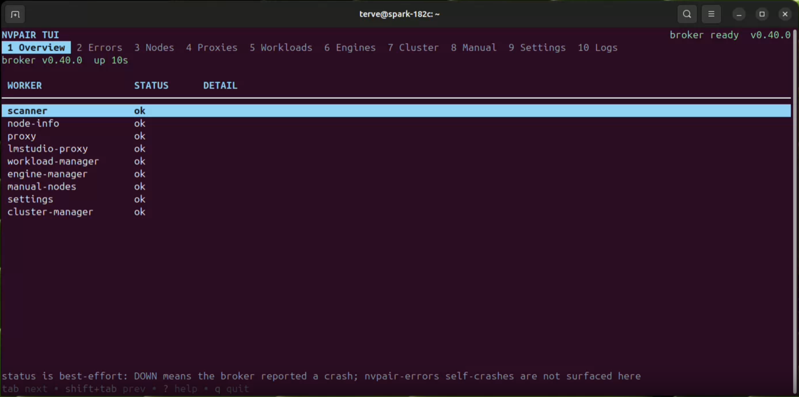
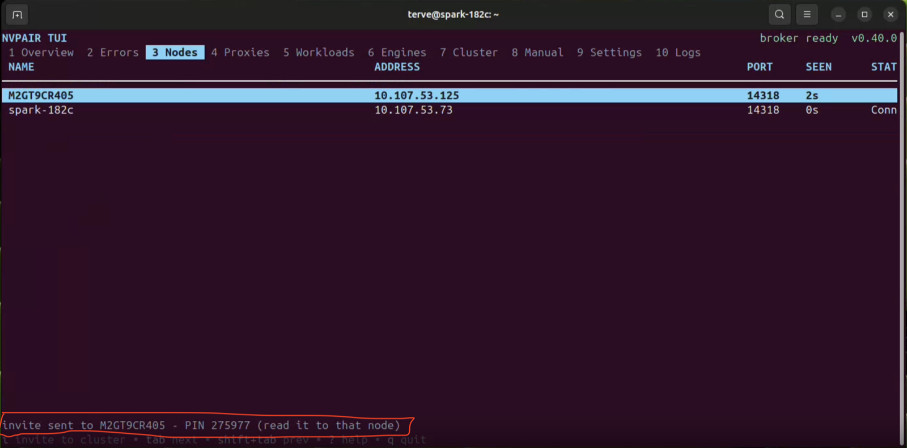
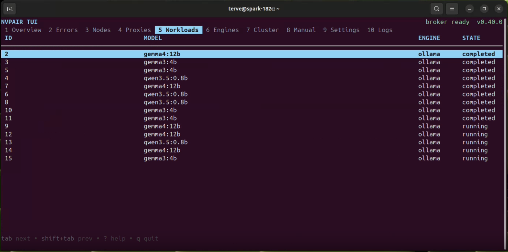

{/*
SPDX-FileCopyrightText: Copyright (c) 2026 NVIDIA CORPORATION & AFFILIATES. All rights reserved.
SPDX-License-Identifier: Apache-2.0
*/}

# Using the PAIR terminal interface

`nvpair-tui` is a full-screen keyboard-driven interface for operating one PAIR
host.

**This is the headless option, not a second UI.** Use it on a machine with no
desktop environment, or over SSH, where the desktop application cannot run. If a
desktop is available, use the desktop application.

**It has known limitations.** It is an operations tool, not a full replacement.
It cannot list or delete models, change an engine's port, update an engine,
control engines on other nodes, or show which node served a workload. The full
list is in
[What the Terminal Interface Cannot Do](#what-the-terminal-interface-cannot-do),
and it is worth reading before you depend on it.

> **Never run the terminal interface and the desktop application on the same
> machine at the same time.** This is not a preference. Each one starts its own
> broker and full worker tree, so two sets of services would fight over the same
> proxy ports, try to manage the same engines, and write the same settings files.
> Expect port conflicts, engines that refuse to start, and confusing state on both
> sides. Quit one before starting the other.

Within its scope it is self-contained. It starts its own service process tree, so
you do not run anything else first.

## `nvpair` and `nvpair-tui` Both Start It

An installed PAIR puts `nvpair` on your `PATH` as a small wrapper that runs
`nvpair-tui`, so either command opens this interface.

**Do not count on `nvpair` existing on a headless machine.** Only the Debian
package writes the wrapper at install time. On Windows and macOS the desktop
application writes it when it starts, so on a machine where you never open the
desktop application — the case this interface exists for — it may never appear.
On macOS it is also skipped when `/usr/local/bin` is not writable. Run
`nvpair-tui` directly when `nvpair` is not found, and do the same for a source
build, which has no wrapper at all. Refer to
[Building PAIR](building.mdx#run-without-the-desktop-application).

## Start It

Before you start it, confirm the desktop application is not running on this
machine, including minimized to the tray or menu bar. Quit it first.

```bash
nvpair-tui
```

From the release archive, extract it and run `nvpair-tui` from the directory the
binaries are in. It looks for `nvpair-ui-broker` beside itself, so keep the
extracted files together:

```bash
cd <directory containing nvpair-tui>
./nvpair-tui
```

| Flag | Effect |
| --- | --- |
| `--broker-path <path>` | Use a service binary that is not beside `nvpair-tui` |
| `--log-level <level>` | Verbosity of the terminal interface's own logging: `debug`, `info`, `warn`, or `error`. PAIR also reads this from `NVPAIR_LOG_LEVEL` |
| `--version` | Print the version and exit |

The interface's own log output goes to stderr, so it never corrupts the display.
Service logs appear on the **Logs** tab instead.

Press `q` to quit. Quitting shuts the services down cleanly rather than leaving
them running.

### Keep It Running After You Disconnect

Quitting stops the services, and losing an SSH connection ends the program the
same way. A node you reach over SSH therefore stops serving requests when your
session drops. Start it inside a terminal multiplexer so the session survives
independently of your connection:

```bash
tmux new -s pair
nvpair-tui
```

Detach with `Ctrl-b d`, and reattach later with `tmux attach -t pair`. The
services keep running in between.

[tmux](https://github.com/tmux/tmux/wiki) and
[GNU Screen](https://www.gnu.org/software/screen/) both work. With Screen, start
with `screen -S pair`, detach with `Ctrl-a d`, and reattach with
`screen -r pair`. Neither ships with PAIR. Install whichever your distribution
provides.

## The Screen

The top line shows `NVPAIR TUI` and the connection state on the right:
`connecting to broker...`, `broker ready v<version>`, or `broker disconnected`.
The second line is the numbered tab bar. The footer shows the keys available on
the current tab.

If you see `starting...`, the interface is waiting for the terminal size. If the
header stays on `connecting to broker...`, the service tree did not come up, and
the **Logs** tab says why.



## Moving Around

| Key | Action |
| --- | --- |
| `tab`, `l`, `→` | Next tab |
| `shift+tab`, `h`, `←` | Previous tab |
| `?` | Toggle full help |
| `q`, `ctrl+c` | Quit |

Within a table, `j` / `k` (or `↓` / `↑`) move the selection, `f` / `b` page, and
`g` / `G` jump to the first and last row.

While you are typing into a field, such as a PIN, an address, a port, or a model
name, every key goes to that field. Press `enter` to submit or `esc` to cancel.
Tab switching and `q` do not work until you do.

## Tabs

| # | Tab | What It Shows |
| --- | --- | --- |
| 1 | **Overview** | Service uptime and version, and an `ok` / `DOWN` table for each worker |
| 2 | **Errors** | Active service errors by severity, age, node, and message |
| 3 | **Nodes** | Nodes discovered on the network, with `Connected` or `In cluster` status |
| 4 | **Proxies** | Both compatible proxies: listening port, discovered upstreams, and which node is selected |
| 5 | **Workloads** | Live inference workloads: ID, model, engine, state, and age |
| 6 | **Engines** | Local engines: installed, running, healthy, and port |
| 7 | **Cluster** | This node's identity, cluster membership, and pairing |
| 8 | **Manual** | Nodes you added by address, with reachability |
| 9 | **Settings** | Node settings: force ports, cluster auto-sync, and cluster ID and name |
| 10 | **Logs** | Service log output, with live log-level control |

## Pair This Machine with Another

Pairing is the same six-digit PIN exchange the desktop application uses.

**To invite a machine you can already see**, from the **Nodes** tab (3):

1. Select it with `j` / `k`.
2. Press `i`. The status line shows the PIN.
3. Read that PIN to whoever is at the other machine.

This is the easier path, because there is no address to type. Prefer it whenever
PAIR has already discovered the machine you want.

**To invite a machine by address**, from the **Cluster** tab (7):

1. Press `i`.
2. Type the other machine's host, or `host:port` if it is not on the default
   pairing port.
3. Press `enter`. The status line shows the PIN.
4. Read that PIN to whoever is at the other machine.

Use this when discovery has not found the machine, for example on a network that
filters multicast.

**To accept an invitation from another machine**, from the **Cluster** tab:

1. Wait for the status line to read `invite received from <name>`.
2. Press `a`.
3. Type the PIN displayed on the inviting machine and press `enter`.

Press `d` instead to decline. After pairing, the peer appears under **Members**.



| Key | Action | Tab |
| --- | --- | --- |
| `i` | Invite the selected discovered node | Nodes |
| `i` | Invite by address | Cluster |
| `a` | Accept an inbound invitation | Cluster |
| `d` | Decline an inbound invitation | Cluster |
| `r` | Remove the selected member | Cluster |
| `L` | Leave the cluster (capital L) | Cluster |

Only pair when you trust both machines and the network. The PIN is a short-lived
bootstrap code, not a durable credential. Refer to the
[security policy](../SECURITY.md).

## Prepare an Engine and a Model

From the **Engines** tab (6), select an engine with `j` / `k`, then:

| Key | Action |
| --- | --- |
| `i` | Install |
| `s` | Start |
| `x` | Stop |
| `r` | Restart |
| `u` | Uninstall |
| `p` | Download a model |

Pressing `p` opens a prompt. Type the model name, for example `qwen4:12b`, and
press `enter`. Progress appears on the status line.

A node can serve a request only when it is online, a compatible engine is
running, and the requested model is present on that node. To route across several
machines, download the same model on each.

## Check Routing and Health

The **Workloads** tab (5) lists inference work as it runs, with its model,
engine, and state.



The **Proxies** tab (4) shows each proxy's listening port and whether it is
routing automatically (`selected=auto`) or pinned to one node. Press `g` to
switch between the two engines, `enter` to pin the highlighted upstream, and `a`
to return to automatic routing. Leave it on automatic unless you are
deliberately testing one node.

The **Overview** tab (1) reports whether each worker is up. Worker status is
best-effort. `DOWN` means a worker reported a crash.

## Look at Errors and Logs

On **Errors** (2), press `c` to clear the selected entry.

On **Logs** (10), scroll with `j` / `k` and the page keys. Set the log level for
the whole service fleet with `d` (debug), `i` (info), `w` (warn), or `e` (error).
This is the first place to look when something has not started.

## Change Settings

On **Settings** (9), move with `j` / `k` and press `enter`. Booleans toggle
immediately. Text fields open for editing, with `enter` to save and `esc` to
cancel.

Change proxy ports on the **Proxies** tab with `p`, not here. Refer to
[Ports](getting-started.mdx#7-connecting-your-agents-and-port-information)
for how PAIR arranges ports.

## What the Terminal Interface Cannot Do

It is an operations tool, not a full replacement for the desktop application:

- It cannot list or delete models. You can download one, but the interface shows
  no model inventory.
- It cannot change an engine's port. The port column is read-only. Use the
  desktop application to change it.
- It cannot update an engine or control engines on other cluster nodes.
- It does not show which node served a particular workload.
- It has no built-in way to send an inference request. Use `curl` or another
  client against the proxy port, as in
  [Getting Started](getting-started.mdx#6-run-your-first-inference).

## See Also

These documents cover related topics:

- [Getting Started](getting-started.mdx) — first-run setup and endpoints
- [Ports](getting-started.mdx#7-connecting-your-agents-and-port-information) —
  which ports to use and how to change them
- [Troubleshooting](troubleshooting.mdx)
- [`nvpair-tui` component reference](../services/nvpair-tui/README.md) — internals
  and build instructions
